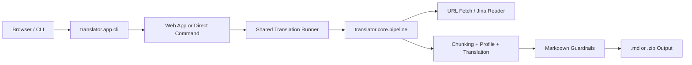

# Translator

<p align="center">
  <strong>一个把网页或 Markdown 转成中文 Markdown 的本地优先翻译工具。</strong>
</p>

<p align="center">
  支持 Web 控制台和 CLI 两种入口。<br />
  你可以翻译单个 URL、上传 <code>url.txt</code> 批量处理，或者直接翻译本地 Markdown 文件。
</p>

<p align="center">
  
  
  
  
  
</p>

<p align="center">
  <a href="#features">Features</a> ·
  <a href="#quick-start">Quick Start</a> ·
  <a href="#usage">Usage</a> ·
  <a href="#configuration">Configuration</a> ·
  <a href="#project-structure">Project Structure</a> ·
  <a href="#development">Development</a>
</p>

## Features

- Web 控制台：浏览器里直接提交单个 URL 或 `url.txt` 批量任务。
- CLI 入口：适合脚本化、自动化和本地调试。
- 单 URL 翻译：输入一条网页链接，输出一个中文 Markdown 文件。
- 批量翻译：上传 `url.txt`，按行读取 URL，完成后输出 ZIP。
- 本地 Markdown 翻译：直接处理已有 `.md` 文件。
- Markdown 护栏：包含 sanitize、normalize、lint、autofix 等结构化处理能力。
- 共享后端：Web 与 CLI 走同一套翻译管线和任务调度逻辑。
- 双环境兼容：提供 Windows 和 WSL 各自的原生启动脚本。
- 默认离线可测：多数测试不依赖真实 API，只有真实后端命令测试在 API Key 存在时才会启用。

## Why This Project

这个仓库最初是一个 Python CLI 翻译器，面向课程网页、文档页面和 Markdown 笔记。当前版本在原有管线之上补了一个本地优先的 Web 控制台，目标是把“可翻译、可启动、可测试、可批量化”这几件事整合到一个统一入口里，而不是再额外维护一套独立前端工程。

适合的场景包括：

- 把英文网页课程材料转成适合继续阅读的中文 Markdown
- 批量抓取并翻译多条文档 URL
- 在本地自动化脚本里复用 CLI
- 在 Windows 和 WSL 两边保持一致的启动方式

## Architecture



Web 模式下，请求会被转成后台任务；CLI 模式下，则直接执行翻译流程。两者最终都会进入同一个共享 runner，再调用核心翻译管线。

## Quick Start

### Requirements

- Python `3.8+`
- `pip`
- `DEEPSEEK_API_KEY`
- 可选的 `JINA_API_KEY`

### Installation

```bash
pip install -r requirements.txt
```

### Environment Variables

在仓库根目录创建 `.env`：

```env
DEEPSEEK_API_KEY=your_deepseek_api_key
JINA_API_KEY=your_jina_api_key
DEEPSEEK_MODEL=deepseek-chat
DEEPSEEK_BASE_URL=https://api.deepseek.com
```

运行命令时会自动加载 `.env`。

### Start The Web UI

```bash
python -m translator serve
```

默认地址：

```text
http://127.0.0.1:10001/
```

指定端口：

```bash
python -m translator serve --port 10002
```

### First CLI Run

翻译本地 Markdown：

```bash
python -m translator translate \
  --in documents/6.031_note1.md \
  --out output/note.zh.md
```

翻译单个 URL：

```bash
python -m translator translate \
  --url https://example.com/article \
  --out output/page.zh.md
```

## Usage

### Web UI

Web 控制台支持两种入口：

#### 1. 单个 URL

1. 启动 `python -m translator serve`
2. 打开浏览器访问本地地址
3. 在 `单 URL` 页签输入目标链接
4. 提交任务
5. 等待任务完成并下载 `.md`

#### 2. 批量 `url.txt`

`url.txt` 格式如下：

```text
# one URL per line
https://example.com/a
https://example.com/b
```

规则：

- 每行一个 URL
- 忽略空行
- 忽略以 `#` 开头的注释行
- 文件应为 UTF-8 编码

批量任务完成后会提供 ZIP 下载。

### CLI

查看总帮助：

```bash
python -m translator --help
```

当前主命令包括：

| Command | Description |
| --- | --- |
| `python -m translator serve` | 启动 Web 控制台 |
| `python -m translator translate` | 统一翻译入口 |
| `python -m translator lint-md` | 检查 Markdown 结构 |
| `python -m translator sanitize-md` | 清洗 Markdown |
| `python -m translator debug-*` | 调试抓取、分块、保护与 profile 流程 |

#### Translate Examples

翻译单个 URL：

```bash
python -m translator translate \
  --url https://sp21.datastructur.es/materials/proj/proj2/proj2 \
  --out output/proj2.zh.md
```

从 `url.txt` 批量翻译：

```bash
python -m translator translate \
  --url-list url.txt \
  --out-dir output/batch
```

翻译本地 Markdown：

```bash
python -m translator translate \
  --in documents/6.031_note1.md \
  --out output/6.031_note1.zh.md
```

检查 Markdown：

```bash
python -m translator lint-md --in output/6.031_note1.zh.md
```

#### Common Translate Options

```bash
python -m translator translate --help
```

常用参数：

- `--url`
- `--in`
- `--url-list` 或 `--url-file`
- `--out`
- `--out-dir`
- `--concurrency`
- `--timeout`
- `--max-chunk-chars`
- `--output-format readable|analysis`
- `--no-snapdown-mermaid`

## API

Web 控制台对外提供的本地接口如下：

| Endpoint | Method | Description |
| --- | --- | --- |
| `/` | `GET` | 控制台首页 |
| `/api/jobs/url` | `POST` | 提交单个 URL 翻译任务 |
| `/api/jobs/url-file` | `POST` | 上传 `url.txt` 并提交批量任务 |
| `/api/jobs/<job_id>` | `GET` | 查询任务状态与明细 |
| `/api/jobs/<job_id>/download` | `GET` | 下载 Markdown 或 ZIP |

单 URL 请求体示例：

```json
{
  "url": "https://example.com/article",
  "output_format": "readable",
  "concurrency": 2,
  "timeout": 30,
  "max_chunk_chars": 5000,
  "snapdown_to_mermaid": true
}
```

## Configuration

| Variable | Required | Default | Description |
| --- | --- | --- | --- |
| `DEEPSEEK_API_KEY` | Yes | None | DeepSeek API Key |
| `DEEPSEEK_MODEL` | No | `deepseek-chat` | 默认模型 |
| `DEEPSEEK_BASE_URL` | No | `https://api.deepseek.com` | OpenAI-compatible 基础地址 |
| `JINA_API_KEY` | No | None | Jina Reader 抓取鉴权 |
| `TRANSLATOR_RETRY_LOG` | No | `1` | 控制 LLM 重试日志 |
| `TRANSLATOR_TIMING_LOG` | No | `1` | 控制阶段耗时日志 |

## Windows And WSL

仓库提供两套原生启动脚本，避免 Windows 和 WSL 共用同一个虚拟环境。

### WSL

```bash
bash ./start_wsl.sh
```

指定端口：

```bash
bash ./start_wsl.sh 10002
```

### Windows PowerShell

```powershell
.\start_windows.ps1
```

指定端口：

```powershell
.\start_windows.ps1 -Port 10002
```

### Windows CMD

```bat
start_windows.bat
```

这些脚本会自动创建虚拟环境、安装依赖，然后启动 `python -m translator serve`。

## Runtime Output

Web 任务默认会写到：

```text
.tmp/web-jobs/<job_id>/
```

其中可能包括：

- 单任务输出的 `.md`
- 批量任务输出的多个 `.md`
- 打包后的 `.zip`

旧任务目录会按 TTL 自动清理。

## Project Structure

```text
translator/
  app/                CLI 入口与命令分发
  core/               翻译主流程、chunking、profile、validation
  io/                 文件与抓取相关输入输出
  llm/                LLM 客户端
  markdown/           Markdown 清洗、归一化、lint、autofix
  runtime/            运行时启动辅助
  services/           共享 runner 与任务编排
  web/                Flask Web UI、任务管理与模板
  *.py                兼容旧导入路径的 shim 模块
tests/                pytest 测试与 fixtures
documents/            示例 Markdown 输入
start_wsl.sh          WSL 启动脚本
start_windows.ps1     Windows PowerShell 启动脚本
start_windows.bat     Windows CMD 启动脚本
```

核心文件：

- `translator/app/cli.py`：CLI 入口和命令分发
- `translator/core/pipeline.py`：核心翻译流程
- `translator/services/translation_runner.py`：共享翻译调度
- `translator/web/app.py`：Flask app 和路由
- `translator/web/jobs.py`：后台任务管理与下载

## Development

### Install Dependencies

```bash
pip install -r requirements.txt
```

### Run Tests

```bash
pytest -q
```

测试覆盖包括：

- CLI 行为测试
- Markdown 处理与结构护栏测试
- 翻译 runner 测试
- Web 路由测试
- Web 端到端测试
- 启动脚本测试
- 有真实 API Key 时的真实命令测试

### Useful Commands

```bash
python -m translator --help
python -m translator serve --help
python -m translator translate --help
```

## Contributing

欢迎提交 Issue 或 Pull Request。提交前建议至少完成以下检查：

```bash
pytest -q
```

PR 描述建议包含：

- 改动目的和用户可见变化
- 影响的是 Web、CLI 还是底层翻译管线
- 验证步骤
- 如果涉及 UI 调整，附上截图

## Notes

- Web 前端采用 Flask + 原生 JavaScript，不依赖 Node 或 Vite。
- CLI 仍然是完整的一等入口，适合自动化脚本和本地批处理。
- 默认测试流程是离线安全的；真实 API 测试会在缺少 Key 时自动跳过。
