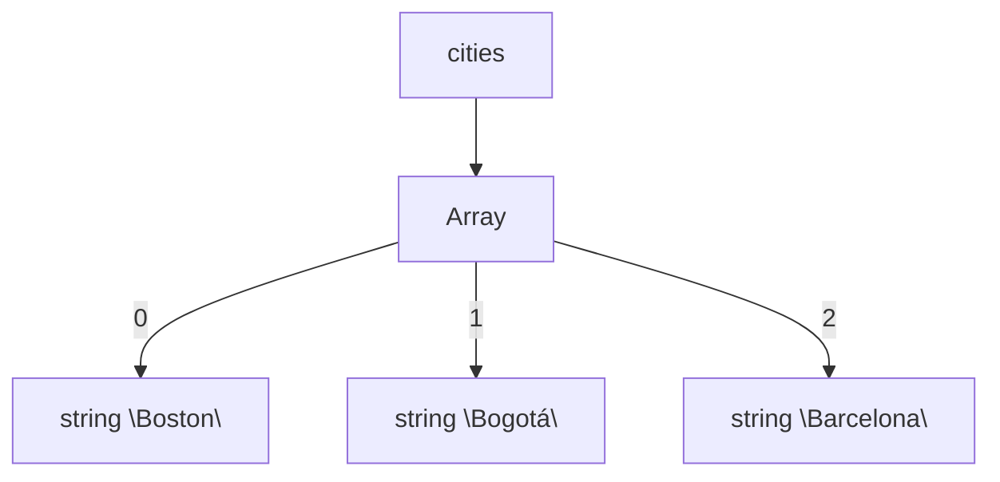
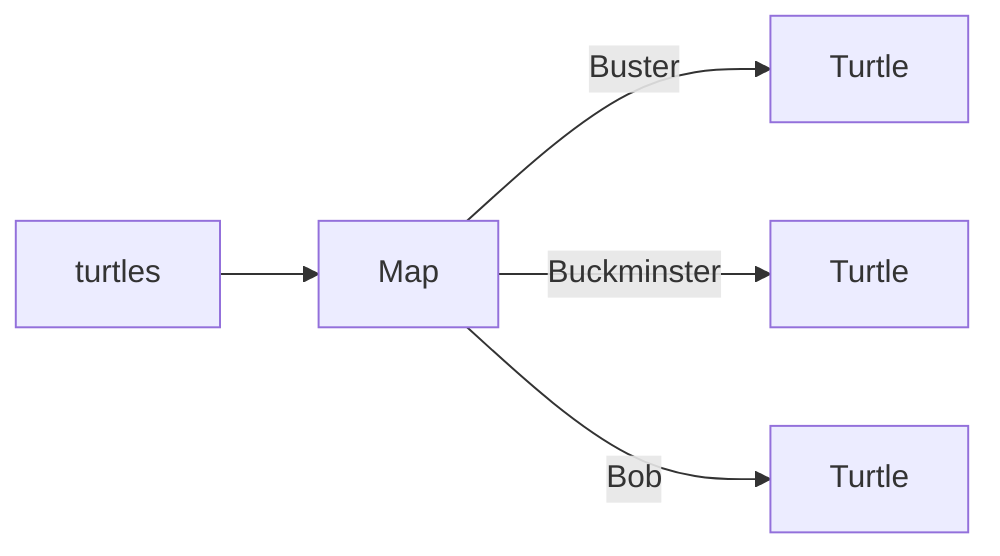
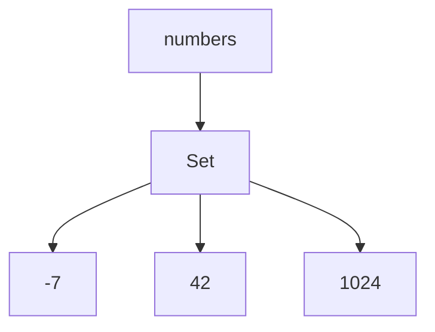
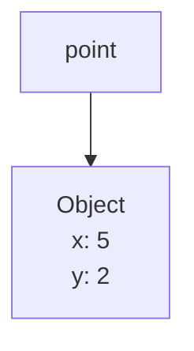

## Meta
- Source: url https://web.mit.edu/6.031/www/sp22/classes/02-basic-typescript/
- Timestamp: 2026-02-24T12:41:50Z
- Model: qwen3.5-397b-a17b

## Outline
### 目标 (Objectives)
- Summary
  - 学习基本的 JavaScript 和 TypeScript 语法与语义
  - 从编写 Python 过渡到编写 TypeScript
- Key takeaways
  - 理解课程的核心目标：安全、易懂、适应变化

### TypeScript 入门 (Getting started with TypeScript)
- Summary
  - 在 Visual Studio Code 中完成 TypeScript Tutor 练习
  - 确认基本类型和数字字符串类别已完成
- Key takeaways
  - 熟悉开发环境设置

### 快照图 (Snapshot diagrams)
- Summary
  - 使用图表表示运行时内部状态（栈和堆）
  - 可视化变量、对象及其内部结构
- Key takeaways
  - 快照图是沟通程序状态的重要工具

### 可变值与变量重新赋值 (Mutating values vs. reassigning variables)
- Summary
  - 区分改变变量指向与改变对象内容
  - 理解不可变 (Immutable) 与可变 (Mutable) 类型
  - 理解不可重新赋值 (Unreassignable) 引用 (const)
- Key takeaways
  - 不可变性和不可重新赋值有助于代码安全

### 数组、映射和集合 (Arrays, Maps, and Sets)
- Summary
  - 对比 TypeScript 集合与 Python 列表、字典、集合
  - 学习 Array、Map、Set 的操作与字面量
  - 理解泛型声明与迭代方法 (for...of)
- Key takeaways
  - 避免使用 for...in 迭代数组或集合
  - 注意迭代时不要修改集合

### 变量声明 (Variable declarations)
- Summary
  - 类型推断机制
  - let 与 const 的选择
  - 避免使用 var
- Key takeaways
  - 优先使用 const，必要时使用 let，避免 var

### 对象字面量与对象类型 (Object literals and object types)
- Summary
  - 创建具有初始化实例变量的对象
  - 记录类型 (Record type) 的使用场景
  - 解构赋值 (Destructuring assignment)
- Key takeaways
  - 对象字面量可用于临时捆绑相关数据

### 枚举 (Enumerations)
- Summary
  - 定义有限的不可变值集合
  - 使用 enum 构造提高类型安全性
- Key takeaways
  - 枚举比数字或字符串常量更安全，可防止拼写错误

### API 文档 (API documentation)
- Summary
  - 了解 MDN、Node.js 和 TypeScript Handbook 三种文档来源
  - 学习如何阅读方法签名和规格说明
- Key takeaways
  - 掌握查阅官方文档的能力

### 编程工具箱 (Programming toolbox)
- Summary
  - 介绍 Visual Studio Code、tsc、Node.js、npm
  - 解释如何实验 TypeScript 代码 (ts-node, Playground)
- Key takeaways
  - 熟悉课程所需的工具链

### 阅读练习 (Reading exercises)
- Summary
  - 完成阅读练习和 TypeScript Tutor 练习
  - 为课堂 nanoquiz 做准备
- Key takeaways
  - 练习需在课前提交以获得学分

## Glossary
| Term (EN) | Term (ZH) | Note (ZH) | Keep EN First Use |
| --- | --- | --- | --- |
| TypeScript | TypeScript (TypeScript) | 编程语言名称，通常保留英文 | true |
| JavaScript | JavaScript (JavaScript) | 编程语言名称，通常保留英文 | true |
| Array | 数组 (Array) | 有序集合类型 | true |
| Map | 映射 (Map) | 键值对集合类型 | true |
| Set | 集合 (Set) | 无序唯一对象集合 | true |
| Immutable | 不可变 (Immutable) | 值创建后无法更改 | true |
| Mutable | 可变 (Mutable) | 值创建后可以更改 | true |
| Stack | 栈 (Stack) | 运行时内存区域，存储方法进度和局部变量 | true |
| Heap | 堆 (Heap) | 运行时内存区域，存储当前存在的对象 | true |
| Enumeration | 枚举 (Enumeration) | 有限的命名常量集合 | true |
| API | 应用程序编程接口 (API) | Application Programming Interface | true |
| Node.js | Node.js (Node.js) | JavaScript 运行时环境 | true |
| Visual Studio Code | Visual Studio Code (Visual Studio Code) | 代码编辑器 | true |

阅读 2：TypeScript (TypeScript) 基础
===============
[6.031](http://web.mit.edu/6.031/www/sp22/)[6.031 — 软件构建 (Software Construction)](http://web.mit.edu/6.031/www/sp22/)

2022 年春季

*   [阅读 2：TypeScript (TypeScript) 基础](https://web.mit.edu/6.031/www/sp22/classes/02-basic-typescript/#reading_2_basic_typescript)
*   [TypeScript (TypeScript) 入门](https://web.mit.edu/6.031/www/sp22/classes/02-basic-typescript/#getting_started_with_typescript)
*   [快照图 (Snapshot diagrams)](https://web.mit.edu/6.031/www/sp22/classes/02-basic-typescript/#snapshot_diagrams)
*   [可变值与变量重新赋值 (Mutating values vs. reassigning variables)](https://web.mit.edu/6.031/www/sp22/classes/02-basic-typescript/#mutating_values_vs_reassigning_variables)
*   [数组 (Array)、映射 (Map) 和集合 (Set)](https://web.mit.edu/6.031/www/sp22/classes/02-basic-typescript/#arrays_maps_and_sets)
*   [变量声明 (Variable declarations)](https://web.mit.edu/6.031/www/sp22/classes/02-basic-typescript/#variable_declarations)
*   [对象字面量与对象类型 (Object literals and object types)](https://web.mit.edu/6.031/www/sp22/classes/02-basic-typescript/#object_literals_and_object_types)
*   [枚举 (Enumeration)](https://web.mit.edu/6.031/www/sp22/classes/02-basic-typescript/#enumerations)
*   [API (API) 文档](https://web.mit.edu/6.031/www/sp22/classes/02-basic-typescript/#api_documentation)
*   [编程工具箱 (Programming toolbox)](https://web.mit.edu/6.031/www/sp22/classes/02-basic-typescript/#programming_toolbox)
*   [阅读练习 (Reading exercises)](https://web.mit.edu/6.031/www/sp22/classes/02-basic-typescript/#reading_exercises)

阅读 2：TypeScript (TypeScript) 基础
=========================================================================================================================

**课前当晚截止：** 你必须在 2 月 1 日星期二晚上 10:00 之前完成本阅读中的阅读练习 (Reading exercises) 和 TypeScript Tutor (TypeScript Tutor) 练习。正如 [课程一般信息 (course general info)](https://web.mit.edu/6.031/www/sp22/general/#classes_readings_and_nanoquizzes) 中所述，这些练习的评分基于你的努力程度，而非正确性。

> **学习批注：** 这种“基于努力程度”的评分机制旨在鼓励你在没有犯错压力的情况下探索新概念。例如，即使你的代码未能通过所有测试用例，只要你展示了尝试解决问题的过程和思考，就能获得分数。这有助于培养成长型思维。

**获取阅读练习 (Reading exercises) 学分：** 右侧有一个红色的 **_登录 (log in)_** 按钮。只有在登录状态下完成阅读练习 (Reading exercises)，你才能获得学分。再次强调，你需要认真对待阅读练习 (Reading exercises) 才能获得满分。

> **背景扩展：** 系统通常通过 Cookie 或会话令牌 (Session Token) 来追踪你的学习进度。如果你未登录，服务器无法将你的提交记录关联到你的学生账户，就像你去图书馆借书却不出示借书证一样，无法记录借阅历史。

**课前截止：** 你必须在 2 月 2 日星期三上午 11:00 上课前完成 [问题集 0 第一部分 (Problem Set 0 Part I)](https://web.mit.edu/6.031/www/sp22/psets/ps0/)。#### 目标（Objectives）

*   学习基本的 JavaScript (JavaScript) 和 TypeScript (TypeScript) 语法（Syntax）与语义（Semantics）
*   从编写 Python (Python) 过渡到编写 TypeScript

> **学习批注：** 语法（Syntax）如同语言的语法规则，决定代码如何书写；语义（Semantics）如同句子的含义，决定代码运行时的行为。从 Python 过渡到 TypeScript 类似于从自由笔记过渡到结构化表单，核心目标是利用类型系统提高代码的安全性（Safety），使其更易懂且适应变化。
#### 6.031 中的软件

| 避免缺陷 (Safe from bugs) | 易于理解 (Easy to understand) | 适应变化 (Ready for change) |
| --- | --- | --- |
| 今天正确，未知的未来也正确。 | 与未来的程序员（包括未来的你）清晰沟通。 | 设计为无需重写即可适应变化。 |

TypeScript (TypeScript) 入门
----------------------------------------------------------------------------------------------------------------------------------

在 Visual Studio Code (Visual Studio Code) 的 TypeScript Tutor 中，完成前两个类别：Basic TypeScript 和 Numbers & Strings。

完成这些类别后，Visual Studio Code (Visual Studio Code) 中的 TypeScript Tutor 面板应显示类别已完全勾选并带有绿色复选标记：


✓Basic TypeScript 2/2

✓Numbers & Strings 2/2

> **学习批注：** 确保环境配置正确是编写类型安全代码的第一步。TypeScript (TypeScript) 编译器会在你保存文件时即时检查类型错误，这有助于在运行前发现潜在问题。

快照图 (Snapshot diagrams)
------------------------------------------------------------------------------------------------------

绘制运行时 (runtime) 发生情况的图片对我们理解微妙的问题很有用。**快照图 (Snapshot diagrams)** 表示程序在运行时 (runtime) 的内部状态：其_栈 (Stack)_（正在进行的方法及其局部变量）和其_堆 (Heap)_（当前存在的对象）。

> **背景扩展：** 快照图类似于调试器中的内存视图，但它更抽象，专注于展示变量与对象之间的引用关系，而非具体的内存地址。这有助于理解数据在内存中是如何组织的。

以下是我们在 6.031 中使用快照图的原因：

*   通过图片相互交流（在课堂和团队会议中）。
*   阐述概念，如不可变 (Immutable) 值与不可重新赋值引用、指针别名、栈 (Stack) 与堆 (Heap)、抽象与具体表示。
*   为后续课程中更丰富的设计符号铺平道路。例如，快照图在 6.170 中概括为对象模型。

虽然本课程中的图表使用 TypeScript (TypeScript) 示例，但符号可应用于任何现代编程语言，例如 Python、Java、C++、Ruby。

最简单的快照图显示一个变量名，带有一个指向变量值的箭头：

```ts
let n:number = 1;
let x:number = 3.5;
```

当我们想显示值的类型，或显示其更多内部结构时，我们使用由其类型标记的圆圈：

```ts
let val:BigInt = BigInt("1234567890");
```

快照图语法旨在灵活，不一定总是显示所有细节，以便我们可以绘制简单的图表，专注于我们要讨论的程序状态的特定方面。

例如，右侧的图表都是显示快照图中字符串变量的合理方式。

```ts
let s:string = "hello";
```

我们可以在不同上下文中使用不同的图表。有时我们关心字符串的特定值，有时我们不关心。有时我们想强调字符串是对象值，有时这不相关。

当我们想显示有关对象值的更多详细信息时，我们将在对象圆圈内写字段名，并用箭头指向它们的值。

```ts
let pt:Point = new Point(5, -3);
```

对于更多细节，字段可以包括其声明的类型。

可变值与变量重新赋值 (Mutating values vs. reassigning variables)
-----------------------------------------------------------------------------------------------------------------------------------------------------

快照图 (Snapshot diagrams) 为我们提供了一种可视化更改变量与改变值之间区别的方法：

*   当你赋值给变量或字段时，你正在更改变量箭头的指向。你可以将其指向不同的值。

*   当你改变可变 (Mutable) 对象（例如数组 (Array)）的内容时，你正在更改该值内部的引用。

> **学习批注：** 注意区分 `const` 保证的是引用不可变（不能指向新对象），而 `Immutable` 保证的是对象内容不可变。两者结合使用最安全，能最大程度减少副作用。
#### 重新赋值与不可变（Immutable）值

例如，如果我们有一个字符串变量 `s`，我们可以将其从值 `"a"` 重新赋值为 `"ab"`。

```ts
let s:string = "a";
s = s + "b";
```


字符串是_不可变_类型的一个例子，这种类型的值一旦创建就永远无法更改。不可变性是本课程的一个主要设计原则，我们将在未来的阅读材料中更多地讨论它。

> **学习批注：** 不可变性意味着对象的状态在创建后无法修改。就像刻在石头上的字，一旦刻好就无法更改，只能换一块石头（创建新对象）。这有助于防止程序中的意外副作用。

在快照图（Snapshot diagram）中，当我们想要强调像字符串这样的对象的不可变性时，我们会用双线边框来绘制它，如此处的图所示。

> **背景扩展：** 双线边框是一种视觉约定，用于提醒开发者该对象的内容是固定的，防止误以为可以修改其内部状态。在调试复杂程序时，这种区分能帮助快速定位数据流向。
#### 可变 (Mutable) 值

相比之下，数组 (Array) 是一个_可变_ 对象，它拥有可以改变对象值的方法：

```ts
let arr:Array<string> = ["a"];
arr.push("b");
```


可变性 (Mutability) 与不可变性 (Immutability) 之间的区别将在使我们的代码_免受 bug 侵害_方面发挥重要作用。

> **学习批注：** 可变对象如同可擦写的白板，内容可随时修改；不可变对象则像打印的文件，生成后无法更改。区分二者能防止意外修改数据，提升代码安全性。
#### 不可重新赋值的引用 (Unreassignable References)

TypeScript (TypeScript) 还为我们提供了引用的不可变性：即只赋值一次且永不重新赋值的变量 (Variable)。为了使引用_不可重新赋值 (Unreassignable)_，请使用关键字 `const` 声明它：

```ts
const n:number = 5;
```


> **学习批注：** 使用 `const` 声明变量是防止意外修改的重要习惯。就像给盒子贴上“封条”，一旦写入内容就无法更改指向，这能有效减少因变量被意外重写导致的 bug。

在此代码中，`n` 永远不能被重新赋值；在其整个生命周期中，它将始终指向值 5。如果 TypeScript (TypeScript) 编译器 (Compiler) 不相信你的 `const` 变量 (Variable) 在运行时只会赋值一次，那么它将产生一个编译器错误。因此，`const` 为你提供了针对不可重新赋值引用的静态检查 (Static Checking)。

在快照图 (Snapshot Diagram) 中，当我们想关注可重新赋值性时，我们将使用双箭头表示不可重新赋值的引用。右侧的图表显示了一个对象，其 `id` 永远不会改变（它不能被重新赋值为不同的数字），但其 `age` 可以改变。

请注意，我们可以拥有一个指向_可变 (Mutable)_ 值的_不可重新赋值引用 (Unreassignable Reference)_，即使我们指向同一个对象，其值也可以改变：

```ts
const arr:Array<string> = ["a"]
arr.push("b");
```


我们也可以拥有一个指向_不可变 (Immutable)_ 值的_可重新赋值引用 (Reassignable Reference)_，其中变量的值可以改变，因为它可以被重新指向不同的对象：

```ts
let s:string = "a";
s = "ab";
```


> **背景扩展：** 区分“引用不可变”和“值不可变”至关重要。就像你不能把吸管插到另一个杯子上（引用不可变），但你可以喝掉杯子里的水（值可变）；或者你可以换一根吸管插到另一个杯子上（引用可变），但杯子本身是密封的（值不可变）。

双线有助于强调快照图 (Snapshot Diagram) 中部分的不可变性 (Immutability)。但当可重新赋值性或可变性 (Mutability) 显而易见，或与讨论无关时，我们将保持图表简单，仅使用单线箭头和对象边框。#### 阅读练习

重新赋值与可变性 1：丢弃堆

```ts
let s:string = "abc";
s.concat("123"); // watch out!
```

这段代码运行后，`s` 指向什么字符序列？

(缺少答案)

(缺少解释)

检查解释

重新赋值与可变性 2：我将传递

```ts
function f(n:number):void {
  n++; // watch out!
}
let i:number = 0;
f(i);
```

这段代码运行后，`i` 指向什么数字？

(缺少答案)

(缺少解释)

检查解释

重新赋值与可变性 3：T-Arr 特约

这是一个对其参数进行可变操作和重新赋值的函数：

```ts
function f(s:string, arr:Array<string>):void {
  s.concat("b");
  s += "c";
  arr.push("d");
}
```

假设它被这样调用：

```ts
let t:string = "a";
let tarr:Array<string> = [t];
f(t, tarr);
```

这段代码运行后，`t` 指向什么字符序列？

`"abcd"` (缺少答案)

`"abc"` (缺少答案)

`"acd"` (缺少答案)

`"ac"` (缺少答案)

`"ad"` (缺少答案)

`"a"` (缺少答案)

在同一时刻，`tarr` 指向什么字符串数组 (Array)？

`["abc","d"]` (缺少答案)

`["abc"]` (缺少答案)

`["ac","d"]` (缺少答案)

`["ac"]` (缺少答案)

`["ad"]` (缺少答案)

`["a","d"]` (缺少答案)

`["a"]` (缺少答案)

(缺少解释)

检查解释

> **学习批注：** 可变性 (Mutable) 指的是对象内容的改变，而重新赋值 (Reassignment) 指的是变量指向新的对象。理解这一区别对于避免副作用至关重要。例如，修改数组内容是可变的，而让变量指向新数组是重新赋值。

请注意，此页面不会跟踪您之前完成的练习。当您重新加载页面时，所有练习都会重置。

如果您是注册学生，可以通过查看 [Omnivore](https://omni.mit.edu/6.031/sp22/user/classes/) 来了解您已经完成了哪些练习。

数组 (Array)、映射 (Map) 和集合 (Set)
--------------------------------------------------------------------------------------------------------------

**[TypeScript (TypeScript) `Array`](https://developer.mozilla.org/en-US/docs/Web/JavaScript/Reference/Global_Objects/Array) 类似于 [Python 列表](https://docs.python.org/3/library/stdtypes.html#sequence-types-list-tuple-range)。** 一个 `Array` 包含零个或多个对象的有序集合，其中同一个对象可能出现多次。我们可以向 `Array` 添加和移除项，它会随着内容的增减而扩大或缩小。

示例 `Array` 操作：

| TypeScript | 描述 | Python |
| --- | --- | --- |
| `lst.length` | 计算元素数量 | `len(lst)` |
| `lst.push(e)` | 在末尾追加元素 | `lst.append(e)` |
| `if ( lst.length === 0 ) ...` | 测试列表是否为空 | `if not lst: ...` |
| `lst.includes(e)` | 测试元素是否在列表中 | `e in lst` |
| `lst.splice(i, 1)` | 移除索引 i 处的元素 | `del lst[i]` |

在快照图 (Snapshot diagram) 中，我们将 `Array` 表示为一个对象，其索引绘制为字段。

这个 `cities` 列表可能代表一次从波士顿到波哥大再到巴塞罗那的旅行。

**[`Map`](https://developer.mozilla.org/en-US/docs/Web/JavaScript/Reference/Global_Objects/Map) 类似于 [Python 字典](https://docs.python.org/3/library/stdtypes.html#mapping-types-dict)。** 在 Python 中，映射 (Map) 的 **键** 必须是 [可哈希的](https://docs.python.org/3/glossary.html#term-hashable)。TypeScript (TypeScript) 有着更严格的要求，我们将在讨论对象之间的相等性工作原理时探讨这一点；目前，最安全的做法是仅使用字符串和数字作为键，而不是任意对象。

> **背景扩展：** 映射 (Map) 的键需要具有稳定的哈希值。在 TypeScript 中，使用对象作为键可能导致意外行为，因为对象相等性通常基于引用而非内容。因此，建议优先使用字符串或数字作为键。

示例 `Map` 操作：

| TypeScript | 描述 | Python |
| --- | --- | --- |
| `map.set(key, val)` | 添加映射 _key → val_ | `map[key] = val` |
| `map.get(key)` | 获取键对应的值 | `map[key]` |
| `map.has(key)` | 测试映射是否包含键 | `key in map` |
| `map.delete(key)` | 删除映射 | `del map[key]` |
| `map.size` | 计算映射数量 | `len(map)` |

在快照图中，我们将 `Map` 表示为包含键/值对的对象。这个 `turtles` 映射 (Map) 包含分配给 `string` 键的 `Turtle` 对象：Bob、Buckminster 和 Buster：

**[`Set`](https://developer.mozilla.org/en-US/docs/Web/JavaScript/Reference/Global_Objects/Set) 是零个或多个唯一对象的无序集合。** 像数学中的 _集合_ 或 [Python 集合](https://docs.python.org/3/library/stdtypes.html#set-types-set-frozenset) 一样——与 `Array` 不同——对象不能在集合中出现多次。要么在里面，要么在外面。像映射 (Map) 的键一样，Python 集合中的对象必须是 [可哈希的](https://docs.python.org/3/glossary.html#term-hashable)。类似地，TypeScript (TypeScript) `Set` 应与适合用作 `Map` 键的类型一起使用，目前这意味着字符串和数字。

> **学习批注：** 集合 (Set) 的核心特性是唯一性。如果您尝试添加已存在的元素，集合不会发生变化。这常用于去重操作，例如移除列表中的重复项。

示例 `Set` 操作：

| TypeScript | 描述 | Python |
| --- | --- | --- |
| `s.has(e)` | 测试集合是否包含元素 | `e in s` |
| `s.add(e)` | 添加元素 | `s.add(e)` |
| `s.delete(e)` | 移除元素 | `s.remove(e)` |
| `s.size` | 计算元素数量 | `len(s)` |

在快照图中，我们将 `Set` 表示为具有无名字段的对象。这里我们有一组整数，顺序不限：42、1024 和 -7：### 字面量 (Literals)

Python 提供了便捷的语法来创建列表 (Lists)：

```python
letters = [ "a", "b", "c" ]
```

以及映射 (Map)：

```python
fruits = { "apple": 5, "banana": 7 }
```

TypeScript (TypeScript) 对于数组 (Array) 字面量具有相同的语法：

```ts
let letters:Array<string> = [ "a", "b", "c" ];
```

但创建 `Map` 字面量的语法要稍微复杂一些。最好的方法是使用键值对 (Key-Value Pairs) 数组，如下所示：

```ts
let fruits:Map<string, number> = new Map([
  ["apple", 5],
  ["banana", 7],
]);
```


> **学习批注：** 虽然 Python 的字典和 TypeScript 的对象字面量看起来相似，但 TypeScript 的 `Map` 类型更像是一个独立的容器类。例如，Python 直接用 `{}` 创建字典，而 TypeScript 创建 `Map` 需要传入一个数组，这类似于你先准备好一堆数据对，再交给工厂生产出一个映射对象。
### 泛型 (Generics)：声明 数组 (Array)、集合 (Set) 和 映射 (Map) 变量 (variables)

与 Python (Python) 集合类型不同，使用 TypeScript (TypeScript) 集合时，我们可以限制集合中包含的对象类型 (type)。当我们添加项时，编译器 (compiler) 可以执行*静态检查 (static checking)*，确保只添加适当类型的项。然后，当我们取出项时，我们可以确信其类型符合预期。

> **学习批注：** 静态检查 (static checking) 是指在代码运行前（编译阶段）就发现错误，而 Python (Python) 通常在运行时才报错。这就像在出发前检查行李清单，而不是到了机场才发现违禁品。

以下是声明一些用于保存集合的变量 (variables) 的语法 (syntax)：

```ts
let cities:Array<string>;      // an Array of strings
let numbers:Set<number>;       // a Set of numbers
let turtles:Map<string,Turtle>; // a Map with string keys and Turtle values
```


TypeScript 提供了另一种声明 `Array` 类型的语法，将方括号 (square brackets) 放在元素类型 (element type) 之后：

```ts
let cities:string[];    // also an Array of strings
```


我们通常使用 `Array<T>` 形式 (form)，以使代码 (code) 含义更清晰，但 `T[]` 形式也可以。注意 `Array<T>` 和 `T[]` 在 TypeScript 中意味着完全相同的事情（不同于你可能遇到的其他语言）。

> **背景扩展：** 虽然 `T[]` 写法更简短，但 `Array<T>` 在处理复杂泛型（如 `Array<Array<T>>`）时可读性更好。这就好比写数学公式时，有时用分数形式比斜杠除法更清晰。
### 迭代 (Iteration)

遍历城市/数字/海龟等是非常常见的任务。

在 Python 中：

```python
for city in cities:
    print(city)

for num in numbers:
    print(num)

for key in turtles:
    print("%s: %s" % (key, turtles[key]))
```


TypeScript (TypeScript) 提供了类似的语法来遍历 数组 (Array) 和 集合 (Set) 中的项，但使用 **of** 而不是 **in**：

```ts
for (const city of cities) {
    console.log(city);
}

for (const num of numbers) { 
    console.log(num);
}
```


TypeScript (TypeScript) 也允许 `let city of cities`，但 `const` 更推荐，因为它防止你在循环体中意外重新赋值 `city`。TypeScript (TypeScript) 不允许声明变量的类型（例如使用 `const city:string of cities`）；`city` 的类型是从 `cities` 的元素类型自动推断的。

> **学习批注：** `for...of` 直接获取集合中的值，而 `for...in` 获取的是键（对于数组来说是索引）。例如，若数组内容为 `["a", "b"]`，`for...of` 会得到 `"a"` 和 `"b"`，而 `for...in` 会得到 `"0"` 和 `"1"`。初学者常在此处混淆，导致取值错误。

**警告**：避免在 TypeScript (TypeScript) 中使用 [`for...in`](https://developer.mozilla.org/en-US/docs/Web/JavaScript/Reference/Statements/for...in)。不幸的是，这是合法的语法，但它的作用与你预期的非常不同。例如，对于 数组 (Array) `['a', 'b']`，`for...in` 不会遍历 数组 (Array) 的元素（`a`、`b`），而是遍历 数组 (Array) 的 _索引_ (0, 1)。对于 集合 (Set) 或 映射 (Map)，`for...in` 会静默地什么都不做，让你以为 集合 (Set) 或 映射 (Map) 是空的，但实际上不是。**避免 `for...in`，改用 `for...of`。**

我们也可以像在 Python 中一样遍历 `Map` 的键或值：

```ts
for (const key of turtles.keys()) {
    console.log(key + ": " + turtles.get(key));
}

for (const value of turtles.values()) {
    console.log(value); // prints each Turtle
}

for (const [key, value] of turtles.entries()) {
    console.log(key + ": " + value);
}
```


在这种 `for` 循环的底层使用的是 [`Iterator`](https://developer.mozilla.org/en-US/docs/Web/JavaScript/Reference/Iteration_protocols)，这是一种我们将在课程后期看到的设计模式。

> **背景扩展：** 迭代器 (Iterator) 是一种对象，它允许你逐个访问集合中的元素，而无需暴露集合的底层表示。就像读书时的书签，它记录了你当前读到的位置，每次翻页（迭代）移动到下一页。

**警告**：小心不要在遍历 集合 (Collection) 时修改它。添加、移除或替换元素会破坏迭代过程，甚至导致程序崩溃。我们将在未来的课程中更详细地讨论原因。注意，此警告也适用于 Python。下面的 Python 代码不会按你预期的那样工作：

```python
numbers = [100,200,300]
for num in numbers:
    numbers.remove(num) # danger!!! mutates the list we're iterating over
print(numbers) # list should be empty here -- is it?
```
#### 使用索引迭代 (Iterating with indices)

虽然你可以这样做，但 TypeScript (TypeScript) 提供了不同的 `for` 循环 (loops)，允许我们使用索引 (indices) 来遍历 数组 (Array)：

```ts
for (let ii = 0; ii < cities.length; ii++) {
    console.log(cities[ii]);
}
```


除非我们确实需要索引值 (index value) `ii`，否则这段代码显得冗长 (verbose)，并且隐藏着更多容易滋生 缺陷 (bugs) 的地方（从 1 开始而不是 0，使用 `<=` 而不是 `<`，在某一次出现 `ii` 时使用了错误的变量名，……）。如果可能的话，请避免使用它。

> **学习批注：** 为什么建议避免使用基于索引的循环？因为手动管理索引容易引发“差一错误”（Off-by-one error）。例如，数组长度为 5，有效索引是 0 到 4，如果循环条件误写为 `i <= length` 就会导致数组越界。相比之下，`for...of` 等现代迭代方式自动处理迭代器，更安全且代码更简洁。
### 映射 (Map) 和数组 (Array) 中的缺失值

如果你尝试使用 `get()` 获取一个未定义的键，它会返回特殊值 `undefined`：

> **学习批注：** 这里的特殊值通常指 `undefined`。在 JavaScript (JavaScript) 中，访问对象不存在的属性不会报错，而是返回 `undefined`，这与 Python 抛出 KeyError 不同。

```ts
const prices: Map<string, number> = new Map();
prices.set("apple", 5);
prices.get("apple")   // returns 5
prices.get("banana")  // returns undefined
```


类似地，如果你使用非法索引访问数组，结果是 `undefined`：

```ts
const fruits: Array<string> = ["apple", "banana"];
fruits[0]   // returns "apple"
fruits[1]   // returns "banana"
fruits[2]   // returns undefined
fruits[-1]  // returns undefined
```


出乎意料的是，JavaScript 数组实际上是_稀疏 (sparse)_ 的：你可以在任意索引处放置新元素，而不仅仅是从 0 开始的连续序列。任何未分配的索引都会返回 `undefined`。例如：

```typescript
const arr:Array<string> = [];
arr[2] = "x";
arr[0]    // returns undefined
arr[1]    // returns undefined
arr[2]    // returns "x"
arr[3]    // returns undefined
```


> **背景扩展：** 稀疏数组就像是一个有很多“洞”的列表。虽然语法允许这样做，但这会破坏数组作为连续内存块的预期行为，导致迭代器跳过空洞或长度计算不符合预期。

数组稀疏性很少被 TypeScript (TypeScript)/JavaScript 程序员使用。大多数时候，数组应该像其他语言中的列表一样使用，索引从 0 开始连续编号。#### 阅读练习

数组 (Array)

写下应填入下方空白处的数组 (Array) 类型，使变量声明与其初始化程序匹配。

`let names:____ = [ 'Huey', 'Dewey', 'Louie' ];` 

（缺少答案）

（缺少解释）

`let numbers:____ = [ 1, 2, 3 ];` 

（缺少答案）

（缺少解释）

`let matrix:_____ = [ [ 1, 0 ], [ 0, 1 ] ];` 

（缺少答案）

（缺少解释）

检查解释

> **学习批注：** 在 TypeScript (TypeScript) 中，虽然类型推断通常能自动识别数组类型，但显式标注类型（如 `string[]`）有助于在重构时捕捉错误。例如，若后续代码误存入数字，编译器会立即报错。

X 标记位置

TypeScript (TypeScript) `Map`s 的工作方式类似于 Python 字典。

运行此代码后：

```ts
let treasures:Map<string,number> = new Map();
let x:string = "palm";
treasures.set("beach", 25);
treasures.set("palm", 50);
treasures.set("cove", 75);
treasures.set("x", 100);
treasures.set("palm", treasures.size);
treasures.delete("beach");
let found:number = 0;
for (const treasure of treasures.values()) {
    found += treasure;
}
```

……的值是什么？

`treasures.get(x)` 

（缺少答案）

`treasures.get("x")` 

（缺少答案）

`found` 

（缺少答案）

（缺少解释）

检查解释

> **背景扩展：** 映射 (Map) 与普通对象不同，它允许任意类型的键，并保持插入顺序。例如，使用 `map.get(key)` 取值比对象属性访问更安全，避免原型链冲突。

Const 或 let

假设你有一个如下所示的数组：

```ts
const cities: Array<string> = ['New York', 'Seoul', 'Paris'];
```

以下哪行代码能正确显示三个城市名称，New York、Seoul 和 Paris？

- [x] `for (let   ii = 0; ii < cities.length; ii++) { console.log(cities[ii]); }` （缺少答案）

- [x] `for (const ii = 0; ii < cities.length; ii++) { console.log(cities[ii]); }` （缺少答案）

- [x] `for (const city in cities) { console.log(city); }` （缺少答案）

- [x] `for (const city of cities) { console.log(city); }` （缺少答案）

（缺少解释）

检查解释

> **学习批注：** 遍历数组 (Array) 时，推荐使用 `for...of` 循环而非 `for...in`，因为后者会遍历索引而非值。例如，`for (const city of cities)` 直接获取元素，避免了对索引类型的混淆。

变量声明
--------------------------------------------------------------------------------------------------------------
### 从初始化器 (Initializer) 推断 (Inference) 类型 (Type)

当我们使用初始化器声明变量 (Variable) 时，通常可以省略类型声明 (Declaration)，TypeScript (TypeScript) 会自动从初始化表达式的类型中推断出它。

> **学习批注：** 类型推断旨在减少冗余代码。例如，写作 `let x = 5` 比 `let x: number = 5` 更简洁，编译器能明白 `x` 是数字。但在复杂场景中，显式标注类型能提高代码可读性。

因此，我们可以不用写：

```ts
let x:number = 5;
let name:string = 'Frodo';
```


而可以直接写：

```ts
let x = 5; // infers that x:number
let name = 'Frodo'; // infers that name:string
```


对于 `Array`、`Set` 和 `Map` 类型，我们可以在声明中写出完整类型，也可以在初始化器中写出，TypeScript 会推断出另一个：

```ts
// full type in the declaration; initializer type inferred
let numbers:Array<string> = [];
let map:Map<string,number> = new Map();

// full type in the initializer; declaration type inferred
let numbers = new Array<string>();
let map = new Map<string,number>();
```


但下面的声明是不完整的，会在后续某处导致静态类型错误：

```ts
let numbers = [];      // NO: what is the element type of the array?
let ages = new Set();  // NO: what is the element type of the set?
let map = new Map();   // NO: what are the types of the keys and values?
```
### `let` vs. `var`

正如我们所见，TypeScript (TypeScript) 有两种声明局部变量 (local variables) 的方式：`let` 用于可能需要重新赋值的变量，而 `const` 用于不可重新赋值的变量。在较旧的 JavaScript (JavaScript) 代码中，你可能也会看到使用 `var` 来声明变量，如下所示：

```ts
var x = 5; // NO: avoid var
```


这些旧式的 `var` 声明**不推荐使用**，因为它们的作用域 (scope) 是整个函数（类似于 Python 变量），而 `let` 变量的作用域仅限其所在的花括号内。

> **学习批注：** 理解作用域差异至关重要。函数作用域（function scope）就像一整栋办公楼，变量在楼内任何房间都能访问；而块级作用域（block scope）就像具体的单个房间，变量离开该房间（花括号）后就不可见了。使用块级作用域能有效避免变量命名冲突和意外修改。

你可以在 TypeScript Handbook 中阅读 [关于 `let` 和 `var` 之间差异的更多信息](https://www.typescriptlang.org/docs/handbook/variable-declarations.html)。#### 阅读练习 (reading exercises)

局部变量 (Local variables)

假设我们正在 TypeScript (TypeScript) 中编辑函数体，声明并使用局部变量。

```ts
let a = 5;     // (1)
if (a > 10) {  // (2)
    let b = 2; // (3)
} else {       // (4)
    b = 4;     // (5)
}              // (6)
b *= 3;        // (7)
```


哪一行 TypeScript (TypeScript) 代码最早导致编译错误？

(缺少答案)

(缺少解释)

检查解释

修复 bug (Fix the bug)

假设我们只需要一个名为 `b` 的变量，选择能修复 bug 并允许代码编译的 _最小_ 更改集：

- [x] 在第 1 行后声明 `let b:number;` (缺少答案)

- [x] 在第 2 行前赋值 `b = 0;` (缺少答案)

- [x] 在第 3 行处赋值 `b = 2;` (缺少答案)

- [x] 在第 5 行处声明并赋值 `let b = 4;` (缺少答案)

- [x] 在第 7 行处声明并赋值 `let b *= 3;` (缺少答案)

(缺少解释)

检查解释

> **学习批注：** 在 TypeScript (TypeScript) 中，变量在使用前必须声明，且在使用前必须明确赋值（除非是可选属性）。这有助于防止因未初始化变量导致的运行时错误。例如，如果你声明了 `let x: number;` 但没有赋值就直接使用 `x`，编译器会报错。

你是谁？(Who are you again?)

如果我们进行了上述必要的更改，如果我们将 if-else 中 `else` 子句的主体注释掉，会发生什么？

`b` 将为 0 (缺少答案)

`b` 将为 3 (缺少答案)

`b` 将为 6 (缺少答案)

我们会在运行程序之前收到来自 TypeScript (TypeScript) 编译器的错误 (缺少答案)

我们会在运行程序时收到错误，在到达最后一行之前 (缺少答案)

我们会在运行程序时收到错误，当到达最后一行时 (缺少答案)

(缺少解释)

检查解释

> **背景扩展：** TypeScript (TypeScript) 的控制流分析会跟踪变量在不同分支中的赋值情况。如果某个分支可能导致变量未赋值就被使用，编译器会发出错误，即使其他分支已经赋值。这保证了代码的安全性。

对象字面量与对象类型 (Object literals and object types)
------------------------------------------------------------------------------------------------------------------------------------

TypeScript (TypeScript) 有一种语法用于创建具有初始化实例变量的对象：

```ts
{ x: 5, y: -2 }
```


(Python 有类似的语法，但创建的是字典，而不是对象。)

此表达式的静态类型是 `{ x:number, y:number }`，可用于声明变量：

```ts
let point: { x: number, y: number } = { x: 5, y: 2 };
```


现在可以使用 `point.x` 和 `point.y` 访问 `point` 所指对象中存储的 `x` 和 `y` 值。

一个仅包含命名字段集合而不含任何方法或操作的对象类型，称为 **[记录类型 (record type)](https://en.wikipedia.org/wiki/Record_(computer_science))** （在 C/C++ 等语言中也称为 _struct_）。我们将在未来的课程中讨论抽象数据类型时看到更好的管理复杂数据的方法。但像这样的简单记录类型对于临时捆绑相关数据非常有用，特别是当函数想要返回多个值时，例如：

> **学习批注：** 记录类型 (record type) 就像是一个简单的数据容器，类似于 Python 中的字典，但具有固定的键和类型。它适合用于临时捆绑相关数据，而不需要定义完整的类。

```ts
function integerDivision(a:number, b:number): { quotient:number, remainder:number } {
    return { 
        quotient: ..., // result of dividing a by b
        remainder: ... // remainder after dividing a by b
    };
}
```


TypeScript (TypeScript) 有许多对象字面量的快捷方式，包括 [解构赋值 (destructuring assignment)](https://developer.mozilla.org/en-US/docs/Web/JavaScript/Reference/Operators/Destructuring_assignment#object_destructuring)：

`const { quotient, remainder } = integerDivision(23, 7);`

此代码声明局部变量 `quotient` 和 `remainder` 并用 `integerDivision()` 返回对象的相应命名字段初始化它们。

枚举 (Enumerations)
--------------------------------------------------------------------------------------------

有时类型具有少量、有限的不可变 (Immutable) 值集合，例如：

*   月份：January, February, …, November, December
*   星期几：Monday, Tuesday, …, Saturday, Sunday
*   罗盘点：north, south, east, west
*   可用颜色：black, gray, red, …

当值集合较小且有限时，将所有值定义为命名常量是有意义的，TypeScript (TypeScript) 称之为 **枚举 (Enumeration)** 并用 `enum` 构造表示。

```ts
enum Month { 
    JANUARY, FEBRUARY, MARCH, APRIL, 
    MAY, JUNE, JULY, AUGUST, 
    SEPTEMBER, OCTOBER, NOVEMBER, DECEMBER
}

enum PenColor { 
    BLACK, GRAY, RED, PINK, ORANGE, 
    YELLOW, GREEN, CYAN, BLUE, MAGENTA
}
```


您可以在变量或方法声明中使用枚举 (Enumeration) 类型名称，如 `PenColor`：

```ts
let drawingColor: PenColor;
```


像使用命名常量一样引用枚举 (Enumeration) 的值：

```ts
drawingColor = PenColor.RED;
```


注意，枚举 (Enumeration) 是一个 distinct new type。旧语言，如 Python 2 或 JavaScript (JavaScript)，倾向于使用数字常量或字符串字面量来表示这样的有限值集合。但枚举 (Enumeration) 更安全，因为它可以捕获诸如类型不匹配之类的错误：

```ts
let month:number = TUESDAY;  //  no error if numeric constants are used
let month:Month = DayOfWeek.TUESDAY; // static error if enumerations are used
```


或拼写错误：

```ts
let color:string = "REd";        // no error, misspelling isn't caught
let drawingColor:PenColor = PenColor.REd; // static error when enumeration value is misspelled
```


> **背景扩展：** 使用枚举 (Enumeration) 而不是字符串或数字可以防止“魔术字符串”错误。例如，如果你拼错了颜色名称，编译器会立即报错，而使用字符串时只有在运行时才会发现问题。

[Python 3 有枚举 (enumerations)](https://docs.python.org/3/library/enum.html)，类似于 TypeScript (TypeScript) 的，尽管不是静态类型检查的。

API 文档 (API documentation)
------------------------------------------------------------------------------------------------------

本阅读材料的前面部分有许多链接到 JavaScript (JavaScript) 和 TypeScript (TypeScript) API 的文档。

API 代表 _应用程序编程接口 (API)_。如果你想编程一个与 Facebook 交互的应用程序，Facebook 会发布一个 API（实际上不止一个，针对不同的语言和框架），你可以对其进行编程。

TypeScript (TypeScript) 是 JavaScript (JavaScript) 的超集，因此它依赖 JavaScript (JavaScript) API 来实现其大部分功能。JavaScript (JavaScript) 又在两种不同的上下文中运行：web 浏览器内部和外部（在 Node.js (Node.js) 中）。每个上下文具有不同功能和不同的 API。

因此，三种 API 文档来源广泛用于 TypeScript (TypeScript)/JavaScript (JavaScript) 编程：

*   [MDN JavaScript 参考](https://developer.mozilla.org/en-US/docs/Web/JavaScript/Reference)，用于 JavaScript (JavaScript) 的一般功能以及特定于 web 浏览器的 API。
*   [Node.js 参考](https://nodejs.org/dist/latest-v14.x/docs/api/)，用于特定于 Node.js (Node.js) 的浏览器外 API。
*   [TypeScript 手册](https://www.typescriptlang.org/docs/handbook/intro.html)，用于特定于 TypeScript (TypeScript) 的功能。

以下是 MDN 中在每个 TypeScript (TypeScript)/JavaScript (JavaScript) 上下文中可用的 API 示例：

*   [**`String`**](https://developer.mozilla.org/en-US/docs/Web/JavaScript/Reference/Global_Objects/String) 是 TypeScript (TypeScript) 称为 `string` 的类型。我们可以通过使用 `"双引号"` 或 `'单引号'` 创建 `String` 对象。

*   [**`Array`**](https://developer.mozilla.org/en-US/docs/Web/JavaScript/Reference/Global_Objects/Array) 类似于 Python 列表。

*   [**`Map`**](https://developer.mozilla.org/en-US/docs/Web/JavaScript/Reference/Global_Objects/Map) 类似于 Python 字典。

以下是来自 Node.js (Node.js) 的一些 API，仅适用于在 Node.js (Node.js) 中运行的程序：

*   [**`fs.readFileSync()`**](https://nodejs.org/dist/latest-v14.x/docs/api/fs.html#fs_fs_readfilesync_path_options) 从磁盘读取文件。

*   [**`os.homedir()`**](https://nodejs.org/dist/latest-v14.x/docs/api/os.html#os_os_homedir) 获取用户主目录的路径名。

以下是我们讨论过的来自 TypeScript (TypeScript) 的一些类型：

*   [**`数组 (Array)`**](https://www.typescriptlang.org/docs/handbook/2/everyday-types.html#arrays)

*   [**`枚举 (Enumeration)`**](https://www.typescriptlang.org/docs/handbook/2/everyday-types.html#enums)

让我们仔细看看 [`Map`](https://developer.mozilla.org/en-US/docs/Web/JavaScript/Reference/Global_Objects/Map) 的 MDN 文档。这里有许多与我们尚未讨论的 TypeScript (TypeScript) 或 JavaScript (JavaScript) 功能相关的内容！保持冷静，重点关注下面的 **粗体内容**。

> **学习批注：** 阅读官方文档是程序员的重要技能。刚开始时，文档可能看起来令人不知所措，但只需关注与你当前任务相关的部分（如方法签名和示例），不必一次性理解所有内容。

右上角是 **搜索框 (search box)**。你可以用它跳转到某个 类 (class) 或 接口 (interface)，甚至直接跳转到特定 方法 (method)。

> **学习批注：** 善用搜索框能显著提高查阅 应用程序编程接口 (API) 文档的效率，特别是在大型类库中定位特定功能时。

接下来：**类 (class) 的描述 (description)**。有时这些描述会有些晦涩，但**这是你理解一个类时应该首先查看的地方**。


如果你想创建一个新的 `Map`，**构造函数 (constructor)** 部分是首先要查看的地方。**构造函数 (constructor)** 不是在 TypeScript (TypeScript) 中获取新 对象 (object) 的唯一方式，但它们是最常见的。

> **背景扩展：** 构造函数类似于 Python 中的 `__init__` 方法，主要负责初始化新创建对象的状态，但它在对象实例化时自动调用。


接下来：**实例属性 (instance properties) 和 实例方法 (instance method) 部分列出了我们可以在 `Map` 对象 (object) 上使用的所有属性和方法**。

**点击方法查看详细描述**。这是你理解方法功能时应该首先查看的地方。

每个详细描述包括：

*   **方法签名 (method signature)**：我们可以看到方法名称及其 参数 (parameters)。
*   完整的 **描述 (description)**。
*   **参数 (Parameters)**：方法 参数 (arguments) 的描述。
*   以及方法 **返回值 (returns)** 的描述。
### 规格说明（Specifications）

这些详细的描述称为**规格说明（Specifications）**。它们使我们能够使用像 `Map`、`String` 或 `Set`_without_ 阅读或理解实现它们的代码那样的工具。

阅读、编写、理解和分析规格说明将是我们在 6.031 课程中的首要任务之一，从几节课后开始。

请注意，许多 MDN 文档页面也有一个名为"Specifications"的部分，指向 ECMAScript 语言标准中更详细的规格说明。（ECMAScript 是由 Ecma International 标准机构正式化的 JavaScript (JavaScript) 语言的官方定义，并被所有主要 Web 浏览器（Web Browser）和 Node.js (Node.js) 使用。）6.031 课程不使用标准机构所要求的那种正式级别的规格说明，而是使用实践软件工程师所使用的级别，这更接近 MDN 页面的描述。因此，除非你很好奇，否则无需点击跳转到 ECMAScript 规格说明。

> **学习批注：** 规格说明就像餐厅的菜单。你通过菜单知道能吃到什么菜（接口/行为），而不需要知道厨师在厨房里具体是如何烹饪的（实现细节）。在软件开发中，良好的规格说明能让使用者在不阅读源代码的情况下正确使用工具。

编程工具箱（Programming Toolbox）
----------------------------------------------------------------------------------------------------------

在 Python 编程中，你可能使用编程编辑器编写代码，然后使用 `python` 命令运行它。（或者你可能使用了像 Spyder 这样的开发环境，或像 Jupyter 这样的计算笔记本。）

在 TypeScript (TypeScript)/JavaScript (JavaScript) 世界中，你需要的工具集更为复杂。本节简要介绍我们将在 6.031 问题集中使用的每个工具。[Getting Started](https://web.mit.edu/6.031/www/sp22/getting-started/) 页面有关于安装所有这些工具的正确版本的说明。

**[Visual Studio Code (Visual Studio Code)](https://code.visualstudio.com/)**。这是我们将要使用的编程编辑器。它对多种语言的编程都有良好的支持，不仅仅是 TypeScript/JavaScript。

**TypeScript (TypeScript) 编译器（Compiler）**。编译器静态检查（Static Checking）你的 TypeScript 代码并将其转换为 JavaScript 代码（我们在 [Static Checking reading](https://web.mit.edu/6.031/www/sp22/classes/01-static-checking/#static_types_at_compile_time_dynamic_types_at_runtime) 中看到了一个示例）。Visual Studio Code 内置了 TypeScript 编译器，会在你输入代码时显示错误消息（Error Messages）。当需要运行代码时，我们将使用 [`tsc`](https://www.typescriptlang.org/docs/handbook/compiler-options.html)（"TypeScript compiler"的缩写）将磁盘上的 TypeScript 文件转换为 JavaScript 文件。我们不会直接运行 `tsc`；相反，我们将通过 `npm` 运行它，如下所述。

> **背景扩展：** 编译器（Compiler）类似于文章的拼写和语法检查器。它在程序运行前（静态）检查代码是否有错误，并将高级语言翻译成机器或解释器能懂的语言。这与 Python 等解释型语言直接在运行时检查错误有所不同， TypeScript 的静态检查能提前发现很多潜在问题。

**[Node.js (Node.js)](https://en.wikipedia.org/wiki/Node.js)**。Node 是一个 JavaScript 解释器（Interpreter）。`node` 命令运行 JavaScript 代码文件，因此它在 Python 世界中起着与 `python` 命令类似的作用。JavaScript 也可以由 Web 浏览器运行。在本课程中，我们将主要使用 `node` 来运行代码，但偶尔也会在 Web 浏览器中运行一些代码。

**[npm](https://docs.npmjs.com/about-npm)**。NPM 是"Node Package Manager"的缩写，它实际上有两个功能。首先，它管理你程序所使用的外部包库（Library）。在你使用几乎任何 TypeScript/JavaScript 项目之前，第一步可能是 `npm install` 以安装它所依赖的所有库。你将习惯于在所有问题集和课堂练习中运行此命令。`npm` 的另一个功能是作为其他编程工具的通用运行器。例如，我们将使用 `npm test` 配合 TypeScript 编译器编译代码并运行测试套件。

*   `npm` 从名为 `package.json` 的文件中获取配置，你可以在我们所有的问题集和课堂练习中找到该文件。如果你好奇可以检查它，但在 6.031 作业中不要修改此文件。
*   当 `npm install` 安装库时，它会将其放入名为 `node_modules` 的子文件夹（Folder）中，因此每个项目都有自己的库副本，而不是全局安装到你的机器上。如果你刚从下载的项目中得到奇怪的错误，可能是因为你还没有运行 `npm install` 来创建你的 `node_modules` 文件夹。

> **学习批注：** npm 的作用类似于 Python 中的 `pip` 配合 `requirements.txt`。它解决了“依赖管理”的问题，确保你的项目使用的是正确版本的库，并且不同项目之间的库不会相互冲突（通过局部安装到 node_modules）。养成在运行新项目前先安装依赖的习惯。
### 实验 TypeScript (TypeScript) 代码

在 Python (Python) 世界中，你可以使用 ``python`` 命令（不带文件参数）来获取 Python 解释器 (Interpreter) 提示符，在那里你可以实验性地编写简短的 Python 代码片段。

> **学习批注：** 交互式提示符类似于一个“沙盒”，允许你快速测试想法而不必创建完整文件。这在调试复杂逻辑时非常有用，就像在草稿纸上计算一样，能立即看到结果。

这在 TypeScript (TypeScript)/JavaScript (JavaScript) 世界中要复杂一些。虽然运行 ``node`` 不带参数确实会给你一个解释器提示符，但它是一个 _JavaScript (JavaScript)_ 提示符，而不是 TypeScript 提示符。单独使用 ``node`` 命令无法理解 TypeScript 的额外功能，如静态检查 (Static Checking)。

这里有两种获取 TypeScript 提示符的方法：

*   在项目中运行 ``npx ts-node``，例如 6.031 问题集或课堂练习中。（如果你收到 Not Found 错误，那么你可能需要 ``npm install ts-node`` 以确保它在项目中已安装。）这将给你一个可以输入 TypeScript 代码（不仅仅是 JavaScript）的提示符，并且你将能够导入项目使用的任何外部库 (Libraries)。

*   在网页浏览器中使用 [TypeScript Playground](https://www.typescriptlang.org/play?target=7)。这为你提供了一个编写和运行简短 TypeScript 代码片段的编辑器，但请注意，你的代码运行在网页浏览器环境中，因此它无法访问 Node.js (Node.js) 提供的任何库。

> **背景扩展：** 本地环境与浏览器环境的主要区别在于 API 可用性。例如，文件系统操作通常在 Node.js 中可用，但在浏览器 Playground 中会被禁用，这是出于安全考虑，防止网页随意读取用户文件。

* * *

阅读练习
------------------------------------------------------------------------------------------------------

此时你应该已经完成上述所有阅读练习。完成阅读练习可以为你每次课堂开始时的 _小测验 (Nanoquiz)_ 做好准备。要检查你的阅读练习状态，请参阅 [Omnivore 上的 classes/02-basic-typescript](https://omni.mit.edu/6.031/sp22/user/classes/02-basic-typescript)。提交练习的截止时间是课前晚上 10:00。

此时你还应该完成下面显示的 TypeScript Tutor 级别。TypeScript Tutor 练习的截止时间也是课前晚上 10:00。


✓Basic TypeScript 2/2

✓Numbers & Strings 2/2

Collaboratively authored by Rob Miller and Max Goldman, with contributions from Saman Amarasinghe, Adam Chlipala, Srini Devadas, Michael Ernst, John Guttag, Daniel Jackson, Martin Rinard, and Armando Solar-Lezama, and from Robert Durfee, Jenna Himawan, Stacia Johanna, Jessica Shi, Daniel Whatley, and Elizabeth Zhou. This work is licensed under [CC BY-SA 4.0](http://creativecommons.org/licenses/by-sa/4.0/).

MIT EECS 2022 年春季课程网站存档 | 最新网站位于 [mit.edu/6.031](http://web.mit.edu/6.031/) | [无障碍访问 (Accessibility)](http://accessibility.mit.edu/)## 快照图（Snapdown Diagrams）（节选）

> **学习批注：** 快照图是沟通程序状态的重要工具，用于表示运行时内部状态，如栈（Stack）和堆（Heap）。例如，变量引用存储在栈中，而实际对象数据存储在堆中，通过图表可清晰区分变量重新赋值与对象内容修改。








