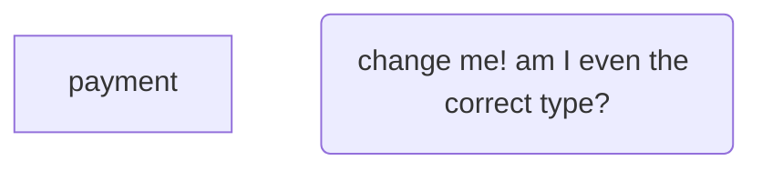
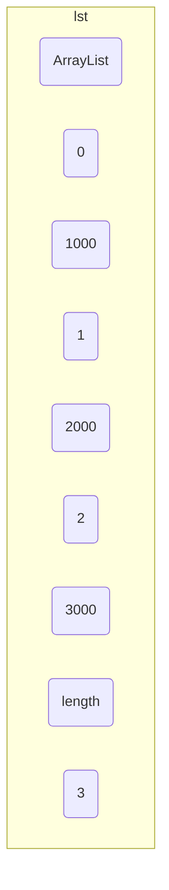
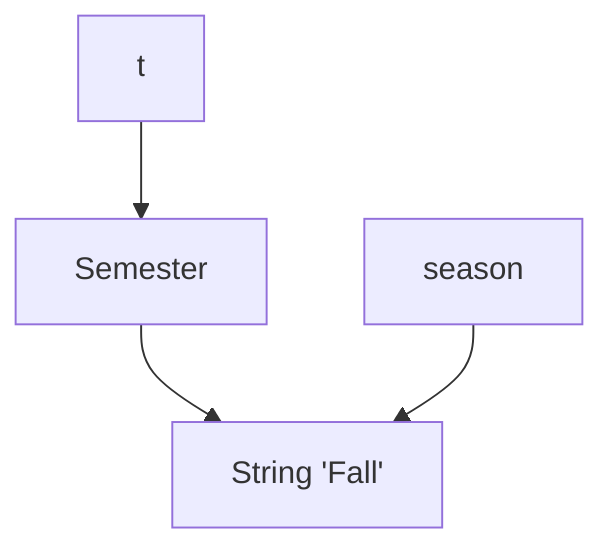
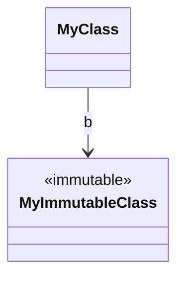
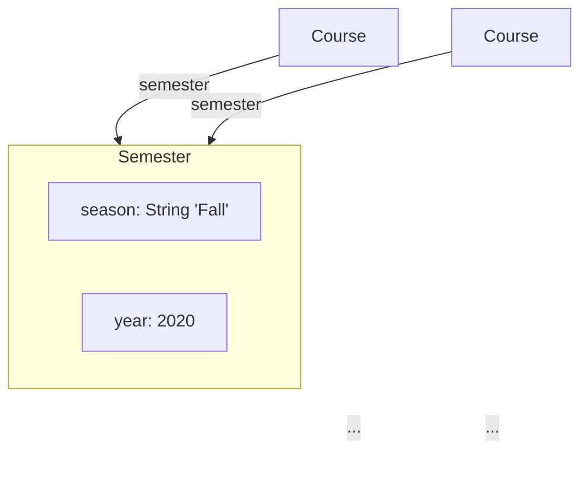

## Meta
- Source: url https://web.mit.edu/6.031/www/sp22/classes/04-code-review/
- Timestamp: 2026-02-25T11:11:47Z
- Model: deepseek-v3.2

## Outline
### 代码审查介绍
- Summary
  - 代码审查是对源代码进行系统化、非原作者参与检查的过程，类似于校对文档。
  - 目的包括改善代码（发现漏洞、提高清晰度）以及提升程序员技能（相互学习）。
  - 在工业界和开源项目（如Google、Apache）中广泛使用，因其能有效发现大部分软件缺陷。
- Key takeaways
  - 代码审查通过系统性检查提升代码质量和团队协作。
  - 早期实践有助于建立代码标准和共享最佳实践。

### 代码风格标准
- Summary
  - 不同项目或公司通常有编码风格指南（如空格、大括号位置），但MIT 6.031课程没有官方风格指南。
  - 推荐参考Idiomatic JavaScript（JavaScript风格）和Google TypeScript Style Guide（TypeScript风格）。
  - Visual Studio Code提供自动格式化工具，鼓励团队一致性和代码清晰性。
- Key takeaways
  - 虽然细节风格可个性化，但团队项目应遵循统一标准以维护代码一致性。
  - 自动化工具（如VS Code的格式化）有助于实现风格一致性。

### 代码原则与示例
- Summary
  - Don't Repeat Yourself (DRY)：避免重复代码以减少错误和维护负担。
  - 在需要的地方添加注释：规范、来源说明和复杂逻辑注释，避免无用注释。
  - 快速失败（Fail Fast）：尽早暴露错误（如静态检查优于动态检查）。
  - 避免魔数（Magic Numbers）：使用命名常量增强可读性和可维护性。
  - 单一目的变量：避免变量重用以防止混淆和错误。
  - 使用好名字：变量和函数名称应清晰、描述性强，并遵循语言命名约定。
  - 使用空白符辅助阅读：一致的缩进和空格提升代码可读性。
  - 避免全局变量：使用局部变量或常量，减少意外副作用。
  - 函数应返回结果而非打印：提高模块化和可重用性。
  - 避免特殊情况的单独处理：通用代码通常能处理特殊情况，减少冗余和错误。
- Key takeaways
  - 这些原则共同提升代码的安全性（Safe from Bugs）、易理解性（Easy to Understand）和可变更性（Ready for Change）。
  - 通过代码审查实践这些原则，有助于建立高质量的编码习惯。

### 练习与总结
- Summary
  - 文档包含多个互动练习，帮助读者理解概念，如代码审查示例（dayOfYear, leap, countLongWords函数）。
  - 总结部分强调代码审查和良好编码原则对软件质量的三大属性（安全、易理解、可变更）的贡献。
  - 提醒读者完成相关练习（如TypeScript Tutor任务）以巩固学习。
- Key takeaways
  - 实践性练习是掌握代码审查和编程原则的关键部分。
  - 睡眠（Sleep）等其他开发实践也有实证支持，强调全面关注开发效率。

## Glossary
| Term (EN) | Term (ZH) | Note (ZH) | Keep EN First Use |
| --- | --- | --- | --- |
| Code Review | 代码审查 | 对源代码的系统化、非原作者检查过程，目的是改进代码和程序员技能。 | true |
| DRY (Don't Repeat Yourself) | 不要重复自己 | 避免代码重复的原则，以减少错误和维护负担。 | true |
| Fail Fast | 快速失败 | 尽早暴露错误的编程原则，以便更快地发现和修复问题。 | true |
| Magic Numbers | 魔数 | 代码中未解释的硬编码数字，应使用命名常量替代以提高可读性。 | true |
| Global Variables | 全局变量 | 在整个程序中可访问的变量，通常应避免使用以减少副作用和错误。 | true |
| Snapshot Diagrams | 快照图 | 用于可视化程序状态的图表，包括对象、引用和值。 | true |
| TypeScript | TypeScript | 一种JavaScript的超集，添加了静态类型和其他功能。 | true |
| Static Checking | 静态检查 | 在程序运行前检查代码错误的过程，有助于快速失败。 | true |

阅读4：代码审查（Code Review）
===============

[**> 隐藏 Snapdown 帮助**](https://web.mit.edu/6.031/www/sp22/classes/04-code-review/#)

 Snapdown 是一种用于**绘制**快照图（Snapshot Diagrams）的语言。

 点击下面的链接查看 Snapdown 的实际应用示例！

 在每个示例中，您将看到一段 Snapdown 语法及其对应的图表并排显示。

[基本类型](https://web.mit.edu/6.031/www/sp22/classes/04-code-review/#)

（点击展开）

此示例包含两个变量：i 指向数值 5，s 指向字符串 "abc"。

i -> 5

s -> "abc"

[对象](https://web.mit.edu/6.031/www/sp22/classes/04-code-review/#)

（点击展开）

此示例中，f 指向一个值为 5.0 的 MyFloat 对象，s 指向一个值为 "abc" 的 MyString 对象。

f -> (MyFloat 5.0)

s -> (MyString "abc")

[字段](https://web.mit.edu/6.031/www/sp22/classes/04-code-review/#)

（点击展开）

这里有一个变量 lst 指向一个 ArrayList，该对象包含三个字段表示元素，以及第四个字段表示长度。（请注意，Java 或其他编程语言的实际内部表示可能并非如此——Snapdown 纯粹是一个绘图工具，可以按照我们的意愿展示任何表示形式。）

lst -> (

ArrayList

0 -> 1000

1 -> 2000

2 -> 3000

length -> 3

)

[栈帧](https://web.mit.edu/6.031/www/sp22/classes/04-code-review/#)

（点击展开）

此示例展示了一个 main() 函数，其中包含局部变量 s 和 season2。

main() {

s -> (

Semester

season -> (String "Fall")

)

season2 -> season

}

t -> s

[字面量](https://web.mit.edu/6.031/www/sp22/classes/04-code-review/#)

（点击展开）

此示例包含一个 MyLine 对象，它具有三个字段。start 和 end 字段最适合表示为一对数字。我们可以使用反引号 `` to display the text (10, 10) verbatim. We can represent the GREEN color in a similar fashion.

(

MyLine

start -> `(10, 10)`

end -> `(20, 20)`

c -> (Color `GREEN`)

)

[Map fields](https://web.mit.edu/6.031/www/sp22/classes/04-code-review/#)

(click to expand)

In this example, we have two maps, each with a single key, and both with the same single value.

s -> (String "value")

m -> (

HashMap

(String "key") = s

)

m2 -> (

HashMap

(String "otherKey") = s

)

[Immutability](https://web.mit.edu/6.031/www/sp22/classes/04-code-review/#)

(click to expand)

Note the double-lined arrows and bubbles indicating immutable references and objects.

a => (

MyClass

b -> ((MyImmutableClass))

)

[Using names as references](https://web.mit.edu/6.031/www/sp22/classes/04-code-review/#)

(click to expand)

In this example, the variable t is an alias of s, and season2 is an (immutable) alias of the season field of s.

s -> (

Semester

season -> ((String "Fall"))

year -> 2020

)

t -> s

season2 => season

[Unnamed references](https://web.mit.edu/6.031/www/sp22/classes/04-code-review/#)

(click to expand)

References are considered unnamed if they start with a hash symbol, #. In this example, the #sem name is never actually drawn in the diagram, but we can use it inside the two Course objects to avoid deeper nesting, and to avoid repeating the same Semester object twice.

#sem -> (

Semester

season -> ((String "Fall"))

year -> 2020

)

c1 -> (

Course

`...`

semester -> #sem

)

c2 -> (

Course

`...`

semester -> #sem

)

[Reassignments](https://web.mit.edu/6.031/www/sp22/classes/04-code-review/#)

(click to expand)

Use an x in the middle of an arrow to indicate that an arrow should be crossed out. Arrows are typically crossed out to indicate reassignment.

a -x> (

MyClass

b -x> ((MyImmutableClass))

)

a -> 5

b => (MyOtherClass)

[6.031](http://web.mit.edu/6.031/www/sp22/)[6.031 — Software Construction](http://web.mit.edu/6.031/www/sp22/)

Spring 2022

*   [Reading 4: Code Review](https://web.mit.edu/6.031/www/sp22/classes/04-code-review/#reading_4_code_review)
*   [Code review](https://web.mit.edu/6.031/www/sp22/classes/04-code-review/#code_review)
*   [Smelly example #1](https://web.mit.edu/6.031/www/sp22/classes/04-code-review/#dayOfYear)
*   [Don’t repeat yourself (DRY)](https://web.mit.edu/6.031/www/sp22/classes/04-code-review/#dont_repeat_yourself_dry)
*   [Comments where needed](https://web.mit.edu/6.031/www/sp22/classes/04-code-review/#comments_where_needed)
*   [Fail fast](https://web.mit.edu/6.031/www/sp22/classes/04-code-review/#fail_fast)
*   [Avoid magic numbers](https://web.mit.edu/6.031/www/sp22/classes/04-code-review/#avoid_magic_numbers)
*   [One purpose for each variable](https://web.mit.edu/6.031/www/sp22/classes/04-code-review/#one_purpose_for_each_variable)
*   [Smelly example #2](https://web.mit.edu/6.031/www/sp22/classes/04-code-review/#leap)
*   [Use good names](https://web.mit.edu/6.031/www/sp22/classes/04-code-review/#use_good_names)
*   [Use whitespace to help the reader](https://web.mit.edu/6.031/www/sp22/classes/04-code-review/#use_whitespace_to_help_the_reader)
*   [Smelly example #3](https://web.mit.edu/6.031/www/sp22/classes/04-code-review/#countLongWords)
*   [Don’t use global variables](https://web.mit.edu/6.031/www/sp22/classes/04-code-review/#dont_use_global_variables)
*   [Functions should return results, not print them](https://web.mit.edu/6.031/www/sp22/classes/04-code-review/#functions_should_return_results_not_print_them)
*   [Avoid special-case code](https://web.mit.edu/6.031/www/sp22/classes/04-code-review/#avoid_special-case_code)
*   [Summary](https://web.mit.edu/6.031/www/sp22/classes/04-code-review/#summary)
*   [Remember the exercises](https://web.mit.edu/6.031/www/sp22/classes/04-code-review/#remember_the_exercises)

Reading 4: Code Review
==========================================================================================================

You must complete the exercises in this reading by 10:00 pm the night before class.

。#### TypeScript 导师练习

继续通过完成 TypeScript 导师中的以下两个类别来推进你的 TypeScript 学习：


✓变量 1/1

✓更多类型 1/1#### 6.031 中的软件

| 远离错误 | 易于理解 | 便于修改 |
| --- | --- | --- |
| 在当前正确，在未知的将来也保持正确。 | 与未来的程序员（包括未来的你）清晰地交流。 | 设计时考虑了适应变化，无需重写。 |#### 课程目标

在今天这堂课中，我们将练习：

*   **代码审查（Code Review）**：阅读和讨论他人编写的代码
*   良好编程的通用原则：在进行任何代码审查时都可以关注的内容，无论编程语言或程序用途是什么

代码审查
-------------------------------------------------------------------------------------

**代码审查（Code Review）** 是指由非代码原作者的人员对源代码进行的仔细、系统化的检查。这类似于对一篇论文进行校对。

> **学习批注：** 代码审查不仅是检查错误，更是团队知识共享和代码质量保证的核心环节。

代码审查实际上有两个目的：

*   **改进代码。** 发现 Bug，预见潜在的 Bug，检查代码的清晰度，并检查其是否与项目的风格标准保持一致。
*   **提升程序员。** 代码审查是程序员相互学习和教学的重要方式，涉及新的语言特性、项目设计或其编码标准的变更以及新技术。特别是在开源项目中，很多对话都发生在代码审查的上下文中。

代码审查在像 Apache 和 [Mozilla](http://blog.humphd.org/vocamus-1569/?p=1569) 这样的开源项目中广泛采用，在工业界也普遍实践。例如，在 [Google 的代码审查流程](https://google.github.io/eng-practices/review/) 中，在没有另一位工程师在代码审查中批准之前，你无法将任何代码推送到主代码仓库。

为什么代码审查被广泛使用？市面上有很多关于软件开发流程的想法（其中一些带有敏捷和 Scrum 这样的流行词）。但代码审查是一种有充分证据表明其实际有效的实践。[Hillel Wayne](https://twitter.com/hillelogram/status/1120495752969641986) 收集了一些研究要点，其中包括代码审查可以发现 70-90% 的软件缺陷，并且 Google 和微软绝大多数的软件工程师都认为它有价值且值得去做。

在 6.031 课程中，我们将在问题集上进行代码审查，具体如课程网站上的 [代码审查文档](https://web.mit.edu/6.031/www/sp22/general/code-review.html) 所述。### 风格标准

大多数公司和大型项目都有编码风格标准。这些标准可能非常详细，甚至具体到空格（缩进深度）以及花括号和括号的位置。这类问题常常引发[圣战](http://www.outpost9.com/reference/jargon/jargon_23.html#TAG897)，因为它们最终往往是品味和风格的问题。

在6.031课程中，我们没有官方的风格指南。如果你是JavaScript和TypeScript的新手，并希望获得建议，那么[Idiomatic JavaScript](https://github.com/rwaldron/idiomatic.js)因其可读性而颇具吸引力，[Google TypeScript Style Guide](https://google.github.io/styleguide/tsguide.html)则对TypeScript特有的问题处理得很好。

Visual Studio Code有一个自动格式化工具（右键单击并选择“格式化文档”），其默认规则与Google风格相似。

但在本课程中，我们不会规定花括号应放在何处。这是每个程序员应自行做出的个人决定。然而，保持自我一致很重要，并且**极其**重要的是遵循你所参与项目的约定。如果你是一个每接触一个模块就重新格式化以匹配个人风格的程序员，你的团队成员会讨厌你，而且这是理所应当的。做一个有团队精神的人。

> **学习批注：** “圣战”（holy war）在这里是技术社区的一个俚语，指关于编程风格（如空格、括号位置）的无休止且高度主观的争论。这些争论通常没有绝对的对错，但容易分散对更重要技术问题的注意力。

但是，有一些规则非常合理，并且比放置花括号更能有力地针对我们的三大特性（可读性、正确性、可维护性）。本读物的其余部分将讨论其中一些规则，至少是在课程当前阶段相关的内容，即我们主要讨论编写基本的TypeScript。当你对其他学生进行代码审查时，或者当你审视自己的代码以寻求改进时，你应该开始关注这些方面。但请不要将其视为代码风格指南的详尽列表。在本学期中，我们将讨论更多内容——规格说明、带有表示不变量的抽象数据类型、并发性和线程安全性——这些随后将成为代码审查的素材。#### 阅读练习



Caesar

本课程将使用的代码审查系统名为 [Caesar](https://caesar.mit.edu/)。它专门设计用于自动、随机地将代码审查任务分发给班上的其他同学。

我们将在“代码审查”课程中首次使用它，但请现在就访问 [Caesar](https://caesar.mit.edu/)，以便在课程开始前完成身份验证。

- [x] 我已访问 Caesar。（缺少答案）

检查解释

代码异味示例 #1
-----------------------------------------------------------------------------------------

程序员常将糟糕的代码描述为有需要清除的“异味”。“代码卫生”是另一个描述此问题的词。让我们从一些有异味的代码开始。

```ts
function dayOfYear(month:number, dayOfMonth:number, year:number):number {
    if (month === 2) {
        dayOfMonth += 31;
    } else if (month === 3) {
        dayOfMonth += 59;
    } else if (month === 4) {
        dayOfMonth += 90;
    } else if (month === 5) {
        dayOfMonth += 31 + 28 + 31 + 30;
    } else if (month === 6) {
        dayOfMonth += 31 + 28 + 31 + 30 + 31;
    } else if (month === 7) {
        dayOfMonth += 31 + 28 + 31 + 30 + 31 + 30;
    } else if (month === 8) {
        dayOfMonth += 31 + 28 + 31 + 30 + 31 + 30 + 31;
    } else if (month === 9) {
        dayOfMonth += 31 + 28 + 31 + 30 + 31 + 30 + 31 + 31;
    } else if (month === 10) {
        dayOfMonth += 31 + 28 + 31 + 30 + 31 + 30 + 31 + 31 + 30;
    } else if (month === 11) {
        dayOfMonth += 31 + 28 + 31 + 30 + 31 + 30 + 31 + 31 + 30 + 31;
    } else if (month === 12) {
        dayOfMonth += 31 + 28 + 31 + 30 + 31 + 30 + 31 + 31 + 30 + 31 + 31;
    }
    return dayOfMonth;
}
```

接下来的几个部分和练习将从这个代码示例中找出具体的异味。

不要重复自己（DRY）
------------------------------------------------------------------------------------------------------------------

重复的代码是安全风险。如果两处存在相同或非常相似的代码，那么根本风险在于两个副本中可能都存在同一个错误，而某位维护者只修复了一处的错误，却忽略了另一处。

避免重复就像避免不看路就过马路一样。复制粘贴是一种极具诱惑力的编程工具，但每次使用时，你都应该感到一丝危险掠过脊背。复制的代码块越长，风险就越大。

[不要重复自己](http://en.wikipedia.org/wiki/Don't_repeat_yourself)，简称 DRY，已成为程序员的信条。

``dayOfYear`` 示例中充满了相同的代码。你会如何应用 DRY 原则来改进它？#### 阅读练习

```mermaid
graph TD;
    payment((payment))
    taxRateChangeMyName((taxRateChangeMyName)) --> "change me! am I even the correct type?"
    payment --> TODO((TODO))
```

不要重复自己（Don’t Repeat Yourself, DRY）

`dayOfYear()` 中的部分重复是重复的值。在 `dayOfYear()` 中，数字“四月的天数”出现了多少次？

(缺失答案)

(缺失解释)

check explain

不要重复自己

重复代码不好的一个原因是，重复代码中的问题需要在多个地方修复，而不是只在一个地方。假设我们的日历改变了，二月真的有30天而不是28天。这段代码中有多少个数字需要修改？

(缺失答案)

(缺失解释)

check explain

不要重复自己

代码中的另一种重复是 `dayOfMonth+=`。假设你有一个列表：

`const monthLength:Array<number> = [ undefined, 31, 28, 31, 30, ..., 31 ];`

使得 `monthLength[month]` 是 `month` 的天数，其中一月用 1 表示。

以下哪个代码框架可以用来足够地“DRY化”代码，使得 `dayOfMonth+=` 只出现一次？

- [x] `for (let m = 1; m < month; ++m) { ... }` (缺失答案)
- [x] `switch (month) { case 1: ...; break; case 2: ...; break; ... }` (缺失答案)
- [x] `while (m < month) { ...; m += 1; }` (缺失答案)
- [x] `if (month === 1) { ... } else { ... dayOfYear(month-1, monthLength[month-1], year) ... }` (缺失答案)

(缺失解释)

check explain

需要时添加注释
---------------------------------------------------------------------------------------------------------

优秀的软件开发人员会在代码中审慎地添加注释。好的注释应使代码更易于理解、更安全（因为重要的假设已被记录在案）、更易于后续修改。

一种关键的注释是规范说明，它出现在函数或类上方，用于记录函数或类的行为。在 TypeScript 中，这通常写成文档注释，以 `/**` 开头，并包含 `@` 语法，例如函数使用 `@param` 和 `@returns`。以下是一个规范说明的示例：

```ts
/**
 * Compute the hailstone sequence.
 * See http://en.wikipedia.org/wiki/Collatz_conjecture#Statement_of_the_problem
 * @param n starting number of sequence; requires integer n > 0.
 * @returns the hailstone sequence starting at n and ending with 1.
 *         For example, hailstone(3)=[3,10,5,16,8,4,2,1].
 */
function hailstoneSequence(n:number):Array<number> {
    ...
}
```

规范说明记录了假设。我们已经多次提到规范，在后续阅读中还会详细讨论。

另一种关键的注释是指明从其他地方复制或改编的代码的来源或出处。这对于实践中的软件开发人员至关重要，并且当您改编在网上找到的代码时，[6.031 合作政策](https://web.mit.edu/6.031/www/sp22/general/collaboration.html)要求必须注明。以下是一个示例：

```java
// reverse a string of digits
// see https://stackoverflow.com/questions/1611427/reversing-a-string-in-javascript
const digitsReversed = digits.split('').reverse().join('');
```

记录来源的一个原因是为了避免侵犯版权。Stack Overflow 上的小段代码通常属于公共领域，但从其他来源复制的代码可能是专有的或受其他类型的开源许可证（限制更多）约束。记录来源的另一个原因是，借用的代码可能存在错误或已过时；这段代码来源的 [Stack Overflow 帖子](https://stackoverflow.com/questions/1611427/reversing-a-string-in-javascript) 有很多关于这种反转字符串的简单方法 _不_ 适用于包含非 ASCII（即非英文字符）字符串的讨论！

有些注释是糟糕且不必要的。例如，直接将代码逐字翻译成英语的注释，无助于提升理解，因为你应该假设你的读者至少懂 TypeScript：

```ts
while (n !== 1) { // test whether n is 1   (don't write comments like this!)
   ++i; // increment i
   l.push(n); // add n to l
}
```

但晦涩的代码应该添加注释：

```ts
let sum = n*(n+1)/2;  // Gauss's formula for the sum of 1...n

// here we're using the sin x ~= x approximation, which works for very small x
let moonDiameterInMeters = moonDistanceInMeters * apparentAngleInRadians;
```

[这个 `dayOfYear` 代码](https://web.mit.edu/6.031/www/sp22/classes/04-code-review/#dayOfYear) 需要一些注释 —— 你会把它们加在哪里？例如，你会在哪里记录 `month` 是从 0 到 11 还是从 1 到 12 运行？#### 阅读练习

在何处添加注释是必要的？

考虑每条注释是否有益于代码理解，将其视为独立存在。

```ts
/** 
 * @param month month of the year, where January=1 and December=12  [C1] 
 */
function dayOfYear(month:number, dayOfMonth:number, year:number):number {
    if (month === 2) {      // we're in February  [C2]
        dayOfMonth += 31;  // add in the days of January that already passed  [C3]
    } else if (month === 3) {
        dayOfMonth += 59;  // month is 3 here  [C4]
    } else if (month === 4) {
        dayOfMonth += 90;
    }
    ...
    } else if (month === 12) {
        dayOfMonth += 31 + 28 + 31 + 30 + 31 + 30 + 31 + 31 + 30 + 31 + 31;
    }
    return dayOfMonth; // the answer  [C5]
}
```

- [ ] C1（缺失答案）
- [ ] C2（缺失答案）
- [ ] C3（缺失答案）
- [ ] C4（缺失答案）
- [ ] C5（缺失答案）

（缺失解释）

检查说明

快速失败（Fail Fast）
---------------------------------------------------------------------------------

**快速失败** 意味着代码应尽可能早地暴露其错误。问题被发现得越早（越接近其根源），就越容易发现和修复。正如我们在[首次阅读](https://web.mit.edu/6.031/www/sp22/classes/01-static-checking/#static_checking_dynamic_checking_no_checking)中所见，静态检查（Static Checking）比动态检查失败得更快，而动态检查又比产生可能破坏后续计算的错误答案失败得更快。

`dayOfYear` 函数并未遵循快速失败原则 —— 如果你以错误的顺序传递参数，它会悄无声息地返回错误答案。实际上，从 `dayOfYear` 的设计方式来看，非美国人很可能以错误顺序传递参数！它需要更多的检查 —— 无论是静态检查还是动态检查。

> **学习批注：** **快速失败**是一种编程原则，旨在通过尽早暴露错误来加速调试过程。例如，静态类型检查在编译阶段就能捕捉到类型不匹配的错误，而不是等到运行时才崩溃。这类似于在组装乐高时立即发现零件不匹配，而不是在完成整个模型后才意识到问题。
#### 阅读练习

快速失败 (Fail Fast)

```ts
function dayOfYear(month:number, dayOfMonth:number, year:number):number {
    if (month === 2) {
        dayOfMonth += 31;
    } else if (month === 3) {
        dayOfMonth += 59;
    } else if (month === 4) {
        dayOfMonth += 90;
    } else if (month === 5) {
        dayOfMonth += 31 + 28 + 31 + 30;
    } else if (month === 6) {
        dayOfMonth += 31 + 28 + 31 + 30 + 31;
    } else if (month === 7) {
        dayOfMonth += 31 + 28 + 31 + 30 + 31 + 30;
    } else if (month === 8) {
        dayOfMonth += 31 + 28 + 31 + 30 + 31 + 30 + 31;
    } else if (month === 9) {
        dayOfMonth += 31 + 28 + 31 + 30 + 31 + 30 + 31 + 31;
    } else if (month === 10) {
        dayOfMonth += 31 + 28 + 31 + 30 + 31 + 30 + 31 + 31 + 30;
    } else if (month === 11) {
        dayOfMonth += 31 + 28 + 31 + 30 + 31 + 30 + 31 + 31 + 30 + 31;
    } else if (month === 12) {
        dayOfMonth += 31 + 28 + 31 + 30 + 31 + 30 + 31 + 31 + 30 + 31 + 31;
    }
    return dayOfMonth;
}
```

假设日期是 2019 年 2 月 9 日。对于这个日期，正确的 `dayOfYear()` 结果是 40，因为这是一年中的第四十天。

人们以各种方式书写日期，日期库也可以用多种方式表示日期。程序员先前的经验很容易让他们对 `dayOfYear()` 的参数做出错误的假设。

以下是程序员可能尝试调用 `dayOfYear()` 来表示 2019 年 2 月 9 日的几种方式。哪些是有缺陷的？这些缺陷会导致静态错误、动态错误还是错误答案？

```ts
dayOfYear(2, 9, 2019)
```

(缺失答案)

(缺失解释)

```ts
dayOfYear(1, 9, 2019)
```

(缺失答案)

(缺失解释)

```ts
dayOfYear(9, 2, 2019)
```

(缺失答案)

(缺失解释)

```ts
dayOfYear("February", 9, 2019)
```

(缺失答案)

(缺失解释)

```ts
dayOfYear(2019, 2, 9)
```

(缺失答案)

(缺失解释)

```ts
dayOfYear(2, 2019, 9)
```

(缺失答案)

(缺失解释)

检查解释

更快地失败

以下设计变更（单独考虑）中，哪些能在参数顺序错误被调用时，使代码更快地失败？

```ts
function dayOfYear(month:string, dayOfMonth:number, year:number):number {
    ... 
}
```

(缺失答案)

(缺失解释)

```ts
function dayOfYear(month:number, dayOfMonth:number, year:number):number {
    if (month < 1 || month > 12) {
        return -1;
    }
    ...
}
```

(缺失答案)

(缺失解释)

```ts
function dayOfYear(month:number, dayOfMonth:number, year:number):number {
    if (month < 1 || month > 12) {
        throw new Error("month out of range");
    }
    ...
}
```

(缺失答案)

(缺失解释)

```ts
enum Month { JANUARY, FEBRUARY, MARCH, ..., DECEMBER };
function dayOfYear(month:Month, dayOfMonth:number, year:number):number {
    ...
}
```

(缺失答案)

(缺失解释)

```ts
function dayOfYear(month:number, dayOfMonth:number, year:number):number {
    if (month === 1) {
        ...
    } else if (month === 2) {
        ...
    }
    ...
    } else if (month === 12) {
        ...
    } else {
        throw new Error("month out of range");
    }
}
```

(缺失答案)

(缺失解释)

检查解释

避免魔数 (Magic Numbers)
-----------------------------------------------------------------------------------------------------

计算机科学界有个笑话，说计算机科学家唯一能理解的数字是 0、1，有时还有 2。

所有其他常量都被称为[魔数](https://en.wikipedia.org/wiki/Magic_number_(programming)#Unnamed_numerical_constants)，因为它们像是凭空出现的，没有任何解释。

解释数字的一种方式是使用注释，但更好的方式是使用一个清晰易懂的名称将数字声明为命名常量。

`dayOfYear` 中充满了魔数，这说明了我们应该避免使用它们的一些原因：

*   **数字比名称更难阅读。** 在 `dayOfYear` 中，月份值 2, …, 12 如果写成 `FEBRUARY`, …, `DECEMBER` 会更容易理解得多。

*   **常量将来可能需要更改。** 使用命名常量，而不是在多个地方重复使用字面量数字，更能适应变化。

*   **常量可能依赖于其他常量。** 在 `dayOfYear` 中，神秘的数字 59 和 90 是特别有害的例子。它们不仅没有注释和文档，实际上还是程序员*手工计算*得出的结果——即某些月份长度的总和。这使得代码更不易理解、更难适应变化，而且肯定更容易产生缺陷 (bugs)。不要对你自己手工计算的数字进行硬编码。应该使用命名常量来清晰地表达它与其他命名常量之间的关系。

对于那些看起来恒定不变的值呢，比如 π，或者三角形的内角和，或者重力常数 `G`？是否有必要给这些不依赖于其他常量的数学和物理学基本常数命名呢？首先，数字本身可能很复杂，重复使用多次不利于防范缺陷 (bugs)。你能轻易判断哪个是对的吗：`3.14159265358979323846` 还是 `3.1415926538979323846`？其次，即使是这些数字也包含了可能在未来改变的设计决策，例如精度位数或测量单位。当这些设计决策发生变化时，使用命名常量更能适应变化。

如果你的代码中充斥着大量的魔数，这可能是一个信号，提示你需要退一步，将这些数字视为*数据*而不是命名常量，并将其放入一个允许更简单代码的数据结构中。在 `dayOfYear` 中，月份的长度（30, 31, 28 等）如果能存储在一个类似列表或映射的数据结构中，例如 `monthLength[month]`，将会更具可读性，并且能更好地遵循 DRY (Don‘t Repeat Yourself, 不要重复自己) 原则。

> **学习批注：** “快速失败”是一种编程思想，旨在让错误尽早暴露，从而更快地进行调试和修复，提高软件的健壮性。例如，在函数入口处验证参数有效性就体现了这一原则。
#### 阅读练习

避免使用魔数

在以下代码中：

```ts
if (month === 2) { ... }
```


一个合理的程序员可能会对魔数 2 的含义做出哪些看似合理的假设？

- [x] 2 可能表示一月（缺失答案）

- [x] 2 可能表示二月（缺失答案）

- [x] 2 可能表示三月（缺失答案）

- [x] 2 可能表示公元 2 年（缺失答案）

（缺失解释）

检查解释

当你假设时会发生什么

假设你正在阅读一些使用了你不熟悉的乌龟图形库的代码，你看到了这行代码：

```ts
turtle.rotate(3);
```


仅从阅读这行代码（不查阅文档），以下哪些可能是你对数字 3 的含义做出的合理假设？

- [x] 3 可能表示顺时针 3 度（缺失答案）

- [x] 3 可能表示逆时针 3 度（缺失答案）

- [x] 3 可能表示顺时针 3 弧度（缺失答案）

- [x] 3 可能表示 3 整圈旋转（缺失答案）

（缺失解释）

检查解释

使用名称而非数字

考虑以下意图绘制规则五边形的代码：

```ts
for (let i = 0; i < 5; ++i) {
    turtle.forward(36);
    turtle.turn(72);
}
```


这段代码中的魔数使其未能满足我们衡量代码质量的三个标准：它不具备防错性、不易于理解且不易于修改。

对于以下每个重写版本，判断它是否改进了防错性、易于理解性和/或易于修改性，或者没有改进（甚至更差）。

```ts
const five = 5;
const thirtySix = 36;
const seventyTwo = 72;
for (let i = 0; i < five; ++i) {
    turtle.forward(thirtySix);
    turtle.turn(seventyTwo);
}
```

- [x] 无改进（或更差）（缺失答案）

- [x] 更防错（缺失答案）

- [x] 更易于理解（缺失答案）

- [x] 更易于修改（缺失答案）

（缺失解释）

```ts
const numbers:Array<number> = [ 5, 36, 72 ]; 
for (let i = 0; i < numbers[0]; ++i) {
    turtle.forward(numbers[1]);
    turtle.turn(numbers[2]);
}
```

- [x] 无改进（或更差）（缺失答案）

- [x] 更防错（缺失答案）

- [x] 更易于理解（缺失答案）

- [x] 更易于修改（缺失答案）

（缺失解释）

```ts
const x = 5;
for (let i = 0; i < x; ++i) {
    turtle.forward(36);
    turtle.turn(360.0 / x);
}
```

- [x] 无改进（或更差）（缺失答案）

- [x] 更防错（缺失答案）

- [x] 更易于理解（缺失答案）

- [x] 更易于修改（缺失答案）

（缺失解释）

```ts
const oneRevolution = 360.0;
const numSides = 5;
const sideLength = 36;
for (let i = 0; i < numSides; ++i) {
    turtle.forward(sideLength);
    turtle.turn(oneRevolution / numSides);
}
```

- [x] 无改进（或更差）（缺失答案）

- [x] 更防错（缺失答案）

- [x] 更易于理解（缺失答案）

- [x] 更易于修改（缺失答案）

（缺失解释）

检查解释

它时隐时现

在以下哪行代码中，`0` 是一个魔数？

- [x] `for (let i = 0; i < total; ++i) { ... }`（缺失答案）

- [x] `if (date.getMonth() === 0) { ... }`（缺失答案）

- [x] `if (array.length === 0) { ... }`（缺失答案）

- [x] `let count = 0;`（缺失答案）

- [x] `setSortingAlgorithm(0);`（缺失答案）

（缺失解释）

检查解释

魔字符串

Louis Reasoner 正在设计一个为不同语言的单词进行**复数化**的函数。他的第一个版本如下：

```ts
/** pluralize `word` using the pluralization rules of `language` */
function pluralize(word: string, language: number);

pluralize('dog', 8);  // returns 'dogs' in English
pluralize('Hund', 7); // returns 'Hunde' in German
```


在收到代码审查（Code Review）意见，指出他的设计中存在魔数后，Louis 将设计修改为：

```ts
/** pluralize `word` using the pluralization rules of `language` */
function pluralize(word: string, language: string);

pluralize('dog', 'English');  // returns 'dogs'
pluralize('Hund', 'Deutsch'); // returns 'Hunde'
```


以下哪些评论对 Louis 的**新**设计是有效的？

- [x] 不防错：客户端可以调用 `pluralize('English', 'dog')` 而不会产生静态错误（缺失答案）

- [x] 不防错：客户端可以调用 `pluralize('Hund', 'Deutch')` 而不会产生静态错误（缺失答案）

- [x] 更易于理解：语言现在有了可读的名称（缺失答案）

- [x] 更易于修改：新设计比旧设计更容易添加更多语言（缺失答案）

（缺失解释）

检查解释

一个变量一个用途
-------------------------------------------------------------------------------------------------------------------------

在 `dayOfYear` 示例中，参数 `dayOfMonth` 被重复用于计算一个非常不同的值——函数的返回值，而这并不是月份中的日期。

不要重复使用参数，也不要重复使用变量。在编程中，变量并不是稀缺资源。可以自由地引入它们，给它们起个好名字，当不再需要时就停止使用。如果一个变量之前表示一个意思，几行代码之后突然开始表示另一个意思，你会让读者感到困惑。

这不仅是一个易于理解的问题，也是一个防错和易于修改的问题。

特别是函数参数，通常应保持不变。（这对于易于修改很重要——将来，函数的其他部分可能想知道函数的原始参数是什么，所以在计算过程中不应该覆盖它们。）尽可能对变量使用 `const` 是一个好主意，因为 `const` 关键字表示该变量不应被重新赋值，并且 TypeScript 编译器会进行静态检查。遗憾的是，TypeScript（目前）尚不支持将函数参数声明为 `const`，以防止在函数体中被重新赋值。

反面示例 #2
------------------------------------------------------------------------------------

`dayOfYear` 中存在一个潜在错误。它根本没有处理闰年。作为修复的一部分，假设我们编写一个闰年判断函数。

```ts
function leap(y:number):boolean {
    let tmp=y.toString();
    if(tmp[2]==='1'||tmp[2]==='3'||tmp[2]==='5'||tmp[2]==='7'||tmp[2]==='9') {
        if(tmp[3]==='2'||tmp[3]==='6') return true; /*R1*/
        else
            return false; /*R2*/
    }else{
        if(tmp[2]==='0' && tmp[3]==='0') {
            return false; /*R3*/
        }
        if(tmp[3]==='0'||tmp[3]==='4'||tmp[3]==='8') return true; /*R4*/
    }
    return false; /*R5*/
}
```


这段代码中隐藏了哪些错误？以及我们已经讨论过的哪些风格问题？

> **学习批注：**
> 在代码审查（Code Review）中，识别魔数（Magic Numbers）和魔字符串是提高代码质量的关键。魔数指代码中直接出现的、未加解释的数字，会降低可读性和可维护性。应使用命名常量替代，使意图更清晰，也便于后续修改。例如，`const DAYS_IN_WEEK = 7;` 比直接使用 `7` 更好。
> 变量重用是另一个常见问题。每个变量应有单一、明确的职责。滥用变量会增加理解难度和引入错误的风险。使用 `const` 声明常量有助于防止意外重新赋值，提升代码的稳定性和可预测性。TypeScript（TypeScript）的静态检查（Static Checking）功能在此能提供帮助，但目前对函数参数使用 `const` 的支持有限。
#### 阅读练习

思维执行 2016

调用以下函数时会发生什么：

`leap(2016)`

在第 R1 行返回 true（缺失答案）

在第 R2 行返回 false（缺失答案）

在第 R3 行返回 false（缺失答案）

在第 R4 行返回 true（缺失答案）

在第 R5 行返回 false（缺失答案）

程序开始前出错（缺失答案）

程序运行时出错（缺失答案）

（缺失解释）

检查解释

思维执行 2017

调用以下函数时会发生什么：

`leap(2017)`

在第 R1 行返回 true（缺失答案）

在第 R2 行返回 false（缺失答案）

在第 R3 行返回 false（缺失答案）

在第 R4 行返回 true（缺失答案）

在第 R5 行返回 false（缺失答案）

程序开始前出错（缺失答案）

程序运行时出错（缺失答案）

（缺失解释）

检查解释

思维执行 10016

调用以下函数时会发生什么：

`leap(10016)`

在第 R1 行返回 true（缺失答案）

在第 R2 行返回 false（缺失答案）

在第 R3 行返回 false（缺失答案）

在第 R4 行返回 true（缺失答案）

在第 R5 行返回 false（缺失答案）

程序开始前出错（缺失答案）

程序运行时出错（缺失答案）

（缺失解释）

检查解释

思维执行 916

调用以下函数时会发生什么：

`leap(916)`

在第 R1 行返回 true（缺失答案）

在第 R2 行返回 false（缺失答案）

在第 R3 行返回 false（缺失答案）

在第 R4 行返回 true（缺失答案）

在第 R5 行返回 false（缺失答案）

程序开始前出错（缺失答案）

程序运行时出错（缺失答案）

（缺失解释）

检查解释

魔数（Magic Numbers）

这段代码中有多少个魔数？如果某些数字出现多次，请分别计数。

（缺失答案）

（缺失解释）

检查解释

DRY（Don't Repeat Yourself）原则

假设你编写了以下辅助函数：

`function isDivisibleBy(num:number, factor:number):boolean { return num % factor === 0; }`
如果 `leap()` 被重写以使用 `isDivisibleBy(year, ...)`，并正确遵循[**闰年算法**](http://en.wikipedia.org/wiki/Leap_year#Algorithm)，那么代码中还会剩下多少个魔数？

（缺失答案）

（缺失解释）

检查解释

使用好的命名
-------------------------------------------------------------------------------------------

好的函数名和变量名应该足够长且具有自描述性。通过使用更具描述性的名称来提高代码本身的可读性，通常可以完全避免注释。

例如，你可以将

```ts
const tmp = 86400;  // tmp is the number of seconds in a day (don't do this!)
```


重写为：

```ts
const secondsPerDay = 86400;
```

一般来说，像 `tmp`、`temp` 和 `data` 这样的变量名是非常糟糕的，它们是极端程序员懒惰的表现。每个局部变量都是临时的，每个变量都是数据，因此这些名称通常毫无意义。最好使用更长、更具描述性的名称，让你的代码本身清晰易读。

遵循语言的词汇命名约定。在 Python 和 TypeScript（TypeScript）中，类名通常以大写字母开头，而变量名和函数名以小写字母开头。但这两种语言在将多词短语转换为函数名或变量名时有所不同。Python 使用 snake_case（用下划线分隔短语中的单词），而 TypeScript 使用 camelCase（除第一个单词外，每个单词首字母大写，例如 `startsWith` 或 `getFirstName`）。

类 Java 语言也使用大小写来区分全局常量（在任何函数外声明的 `const`）与变量和局部常量。`ALL_CAPS_WITH_UNDERSCORES` 用于全局常量。但在函数内部声明的局部变量，包括像上面的 `secondsPerDay` 这样的局部常量，都使用 camelCaseNames。

在任何语言中，函数名通常是动词短语，如 `getDate` 或 `isUpperCase`，而变量名和类名通常是名词短语。选择简短的单词，力求简洁，但避免缩写。例如，`message` 比 `msg` 更清晰，`word` 比 `wd` 好得多。请记住，你的许多同学和现实世界中的同事可能并非以英语为母语，缩写对非母语者来说可能更难理解。

完全避免使用单字符变量名，除非它们在约定俗成的情况下易于理解。例如，`x` 和 `y` 适用于笛卡尔坐标，`i` 和 `j` 适用于 `for` 循环中的整数变量。但如果你的代码中充满了像 `e`、`f`、`g` 和 `h` 这样的变量，仅仅因为你在按字母表顺序挑选它们，那么代码将变得极其难以阅读。

[Effectively Naming Software Thingies](https://medium.com/@rabinovichsagi/effectively-naming-software-thingies-fcea9d78a699) 提供了一些关于命名的优秀建议。罗伯特·马丁的[《代码整洁之道》](https://lib.mit.edu/record/cat00916a/mit.001511591)（第 2 章）也强烈推荐阅读。

`leap` 函数的命名很糟糕：函数名本身和局部变量名。你会给它们起什么更好的名字呢？#### 阅读练习

函数命名优化

```ts
function leap(y:number):boolean {
    let tmp = y.toString();
    if (tmp[2] === '1' || tmp[2] === '3' || tmp[2] === '5' || tmp[2] === '7' || tmp[2] === '9') {
        if (tmp[3] === '2' || tmp[3] === '6') return true;
        else
            return false;
    } else {
        if (tmp[2] === '0' && tmp[3] === '0') {
            return false;
        }
        if (tmp[3] === '0' || tmp[3] === '4' || tmp[3] === '8') return true;
    }
    return false;
}
```

以下哪些是 `leap()` 函数的好名字？

- [x] `leap`（缺少说明）
- [x] `isLeapYear`（缺少说明）
- [x] `IsLeapYear`（缺少说明）
- [x] `is_divisible_by_4`（缺少说明）

（缺少说明）

查看解释

变量命名优化

以下哪些是 `leap()` 函数内 `tmp` 变量的好名字？

- [x] `leapYearString`（缺少说明）
- [x] `yearString`（缺少说明）
- [x] `temp`（缺少说明）
- [x] `secondsPerDay`（缺少说明）
- [x] `s`（缺少说明）

（缺少说明）

查看解释

省略注释

重命名此变量，以便完全删除注释：

```ts
let a = 18;  // this variable stores the age when you can first vote
```

将 `a` 重命名为：

（缺少答案）

（缺少说明）

查看解释

类型

好名字会暗示其类型——即它们可以表示哪些类型的值。以下哪些名字向读者传达了其类型信息？

- [x] `b`（缺少说明）
- [x] `bookTitle`（缺少说明）
- [x] `date`（缺少说明）
- [x] `getAge()`（缺少说明）
- [x] `previous`（缺少说明）
- [x] `tmp`（缺少说明）
- [x] `widthInPixels`（缺少说明）

（缺少说明）

查看解释

使用空格辅助阅读
---------------------------------------------------------------------------------------------------------------------------------

使用一致的缩进。[`leap`](https://web.mit.edu/6.031/www/sp22/classes/04-code-review/#leap) 示例在这方面做得不好，而 [`dayOfYear`](https://web.mit.edu/6.031/www/sp22/classes/04-code-review/#dayOfYear) 示例则好得多。实际上，`dayOfYear` 将所有数字对齐到列中，便于人类读者比较和检查。这是空格的一个绝佳用法。

在代码行内添加空格以提高可读性。leap 示例中有许多行紧密堆积在一起，难以阅读：

`if(tmp[2]==='1'||tmp[2]==='3'||tmp[2]==='5'||tmp[2]==='7'||tmp[2]==='9') {`
在二元运算符（如 `===` 和 `||`）周围使用空格将其分隔开来，使其更醒目，并在多行使用对齐，让相似和差异之处对读者一目了然：

```
if (   tmp[2] === '1'
        || tmp[2] === '3' 
        || tmp[2] === '5'
        || tmp[2] === '7'
        || tmp[2] === '9' ) {
```

切勿使用制表符进行缩进，只使用空格字符。注意，这里说的是*字符*，而不是按键。我们并不是说你永远不应该按 Tab 键，而是说你的编辑器在响应你按下 Tab 键时，永远不应该在源文件中插入制表符。这条规则的原因是，不同工具对制表符的处理方式不同——有时将其扩展为 4 个空格，有时是 2 个，有时是 8 个。如果在命令行中运行“git diff”，或者在另一个编辑器中查看源代码，缩进可能会完全混乱。只使用空格。请始终将你的编程编辑器设置为在你按下 Tab 键时插入空格字符。在 6.031 课程中，假设你已按照“入门指南”的说明设置，你所使用的编辑器应该已经以此方式配置好了。

代码异味示例 #3
----------------------------------------------------------------------------------------------

以下是第三个代码异味示例，它将说明本文档中剩余的几个要点。

```ts
let LONG_WORD_LENGTH = 5;
let longestWord;

function countLongWords(text:string):void {
    let words:Array<string> = text.split(' ');
    if (words.length === 0) {
        console.log("0");
        return;
    }
    let n = 0;
    longestWord = "";
    for (let word of words) {
        if (word.length > LONG_WORD_LENGTH) ++n;
        if (word.length > longestWord.length) longestWord = word;
    }
    console.log(n);
}
```

避免使用全局变量
------------------------------------------------------------------------------------------------------------------

避免使用全局变量（Global Variables）。我们来分解一下*全局变量*的含义。全局变量是：

*   一个*变量*，即其值可以更改的名称
*   该变量是*全局的*，可以在程序的任何位置访问和更改。

[全局变量是有害的](http://c2.com/cgi/wiki?GlobalVariablesAreBad) 很好地列出了全局变量的危险。

在 TypeScript 中，全局变量是在任何函数定义之外使用 `let` 或 `var` 声明的。

然而，如果使用 `const` 声明，并且该变量的类型是不可变的，那么该名称就变成了一个*全局常量*。全局常量可以在任何地方读取，但永远不会被重新赋值或改变，因此风险就消失了。全局常量是常见且有用的。

一般来说，将全局变量转换为参数和返回值，或者将它们放在你正在调用函数的对象内部。在后续的阅读材料中，我们将看到许多实现这一点的技术。#### 阅读练习

识别全局变量

在[上面的“代码异味示例 #3”](https://web.mit.edu/6.031/www/sp22/classes/04-code-review/#countLongWords)中，哪些是全局变量？

- [x] `countLongWords` (缺失答案)

- [x] `n` (缺失答案)

- [x] `LONG_WORD_LENGTH` (缺失答案)

- [x] `longestWord` (缺失答案)

- [x] `text` (缺失答案)

- [x] `word` (缺失答案)

- [x] `words` (缺失答案)

(缺失解释)

检查解释

`const` 的效果

通过使用 ``const`` 关键字将变量声明为常量，可以消除全局变量的风险。当使用 ``const`` 关键字时，以下每个变量会发生什么？请仔细查看[“代码异味示例 #3”](https://web.mit.edu/6.031/www/sp22/classes/04-code-review/#countLongWords)中变量的使用方式。

`n`

(缺失答案)

(缺失解释)

`LONG_WORD_LENGTH`

(缺失答案)

(缺失解释)

`longestWord`

(缺失答案)

(缺失解释)

`word`

(缺失答案)

(缺失解释)

`words`

(缺失答案)

(缺失解释)

检查解释### 快照图中的变量类型

绘制快照图时，区分不同类型的变量至关重要：

*   **局部变量**：位于函数内部
*   **实例变量**：位于对象实例内部
    *   实例变量也可称为**属性**（尤其在 TypeScript/JavaScript 中）、**成员变量**（C++）、**属性**（Python）或**字段**（Java）。
*   **全局变量**：位于任何函数或对象之外

> **学习批注：** 局部变量的生命周期始于函数调用时，结束于函数返回时。如果同一函数被多次调用（例如由于递归），则每次调用都拥有自己独立的局部变量。

实例变量在通过 ``new`` 创建对象时产生，并在对象不可访问且被垃圾回收时消失。每个对象实例都有自己的实例变量。

全局变量在其声明语句执行时产生，并在程序的剩余生命周期内持续存在。

以下是一个使用所有三种类型变量的简单代码片段：

```ts
let taxRate = 0.05;

class Payment {
    public value:number;
}

function main():void {
    const payment:Payment = new Payment();
    payment.value = 100;
    taxRate = 0.05;
    console.log(payment.value * (1 + taxRate));
}
```


快照图以不同方式展示每种变量。在接下来的两个练习中，你将构建一个展示此程序状态的快照图。#### 阅读练习

绘制堆内存图

_Snapdown_ 是一种用于通过文本来绘制快照图的小型语言。打开 _Snapdown 帮助侧边栏_ 以获取语法细节。侧边栏的前三个部分 —— _基本类型_、_对象_ 和 _字段_ —— 对本练习会很有用。

显示 Snapdown 帮助侧边栏

编辑下面的 Snapdown 代码，使得右侧的图表展示上述 `payment` 和 `taxRate` 在 `main` 函数结束时的最终状态。

（缺少答案）**图表更新已暂停：无法解析 Snapdown 输入**

（缺少解释）

检查 解释

绘制栈内存图

变量 `payment` 是 `main()` 函数的 _局部_ 变量。变量 `taxRate` 是 _全局_ 变量。

使用栈帧，绘制一个能展示这两个变量区别的快照图。Snapdown 帮助侧边栏中的 _栈帧_ 部分在这里会很有用。

显示 Snapdown 帮助侧边栏

（缺少答案）**图表更新已暂停：无法解析 Snapdown 输入**

（缺少解释）

检查 解释

函数应该返回结果，而非打印它们
------------------------------------------------------------------------------------------------------------------------------------------------------------

`countLongWords` 不具备良好的可变更性。它通过 `console.log()` 将其部分结果发送到控制台。这意味着，如果你想在另一个上下文中使用它 —— 例如当这个数字需要用于计算而非给人看时 —— 就不得不重写这个函数。

一般而言，只有程序的最高层级部分才应该与用户或控制台交互。较低层级的部分应该通过参数接收输入，并以返回值的形式输出结果。唯一的例外是调试输出，这部分内容当然可以打印到控制台。但这类输出不应成为你设计的一部分，而只应是你调试设计的方式。

> **学习批注：** 这里强调了一个重要的编程原则：分离关注点。计算逻辑应与界面逻辑（如打印）解耦。这样做的好处是提高了代码的**可复用性**。例如，一个纯计算的函数既可以在命令行程序中使用，也可以在 Web 服务或图形界面中使用，而无需修改其内部逻辑。
#### 阅读练习

返回结果

如果要将 `countLongWords` 改为返回当前打印到控制台的结果，以下哪些函数签名能够返回该值？在给定的选项中，哪个是最佳选择？

能够返回结果：

- [x] `function countLongWords(text:string):void`（缺少答案）

- [x] `function countLongWords(text:string):number`（缺少答案）

- [x] `function countLongWords(text:string):string`（缺少答案）

- [x] `function countLongWords(text:string):Array<number>`（缺少答案）

返回结果的最佳选择：

`function countLongWords(text:string):void`（缺少答案）

`function countLongWords(text:string):number`（缺少答案）

`function countLongWords(text:string):string`（缺少答案）

`function countLongWords(text:string):Array<number>`（缺少答案）

（缺少解释）

检查解释

返回两个结果

`countLongWords` 函数实际上有两个结果——当前打印到控制台的 `n` 和当前存储在全局变量中的 `longestWord`。以下哪些函数签名能够返回这两个结果，而不打印到控制台或使用全局变量？在给定的选项中，哪个是最佳选择？

能够返回两个结果：

- [x] `function countLongWords(text:string):void`（缺少答案）

- [x] `function countLongWords(text:string):number`（缺少答案）

- [x] `function countLongWords(text:string):string`（缺少答案）

- [x] `function countLongWords(text:string):Array<string>`（缺少答案）

- [x] `function countLongWords(text:string):[string, number]`（缺少答案）

- [x] `function countLongWords(text:string):{count:number, longestWord:string}`（缺少答案）

返回两个结果的最佳选择：

`function countLongWords(text:string):void`（缺少答案）

`function countLongWords(text:string):number`（缺少答案）

`function countLongWords(text:string):string`（缺少答案）

`function countLongWords(text:string):Array<string>`（缺少答案）

`function countLongWords(text:string):[string, number]`（缺少答案）

`function countLongWords(text:string):{count:number, longestWord:string}`（缺少答案）

（缺少解释）

检查解释

避免特殊情况代码
-------------------------------------------------------------------------------------------------------------

程序员常常倾向于编写特殊代码来处理看似特殊的情况——例如参数为0、空数组或空字符串。`countLongWords` 示例就陷入了这个陷阱，因为它特殊处理了空的 `words` 数组：

```ts
if (words.length === 0) {
    console.log("0");
    return;
}
let n = 0;
longestWord = "";
for (let word of words) {
    if (word.length > LONG_WORD_LENGTH) ++n;
    if (word.length > longestWord.length) longestWord = word;
}
console.log(n);
```

开头的 `if` 语句是不必要的。如果省略它，并且 `words` 数组为空，那么 `for` 循环就什么也不做，最终仍然会打印 `0`。实际上，单独处理这种特殊情况可能导致一个潜在的缺陷——与恰好没有长单词的非空数组相比，处理空数组的方式存在差异。

> **学习批注：** 这里的关键原则是“保持代码简洁通用”。特殊情况的处理往往引入不必要的复杂性和潜在的缺陷边界。通用代码通常能自然覆盖边界情况，例如空数组循环时直接跳过迭代，无需额外判断。

**积极抵制单独处理特殊情况的诱惑。** 如果你发现自己为特殊情况编写 `if` 语句，请停下来，更深入地思考通用代码，要么确认它实际上已经能处理你所担心的特殊情况（这通常是事实！），要么再多花点精力让它处理特殊情况。如果你甚至还没有编写通用代码，只是想先处理简单情况，那么你的顺序就错了。应该先解决通用情况。

编写更广泛、通用的代码是有回报的。它能使函数更短，更容易理解，隐藏缺陷的地方也更少。它可能更安全无缺陷（Safe from Bugs），因为它对所处理的值的假设更少。它也更容易应对变化（Ready for Change），因为当需要改变函数行为时，需要更新的地方更少。

有些程序员为单独处理特殊情况辩护，认为这能通过为特殊情况立即返回硬编码的答案来提高函数的整体性能。例如，在编写排序算法时，很容易在函数一开始就检查列表的大小是否为0或1，因为这样你就可以立即返回，根本不需要排序。或者如果大小是2，只需进行一次比较和可能的交换。这些优化可能确实有意义——但前提是你有证据表明它们确实对程序速度有影响！如果排序函数几乎不会遇到这些特殊情况，那么为它们添加代码只会增加复杂性、开销和隐藏缺陷的地方，而不会带来任何实际的性能提升。首先编写一个干净、简单、通用的算法，然后只在确实有帮助的情况下才进行优化。#### 阅读练习

隐藏于特殊情况中的 Bug

代码异味示例 #3（如下所示）以一个 `if` 语句开头，用于处理一个特殊情况，打印 `0`，然后立即返回。但这使得该特殊情况的行为与其它情况不一致，例如当列表非空但其中没有长单词时，代码会打印 `0`。该特殊情况还需要执行通用情况代码中的哪一行？

```ts
if (words.length === 0) {
             console.log("0");
             return;
         }
/*A*/    let n = 0;
/*B*/    longestWord = "";
/*C*/    for (let word of words) {
/*D*/        if (word.length > LONG_WORD_LENGTH) ++n;
/*E*/        if (word.length > longestWord.length) longestWord = word;
         }
/*F*/    console.log(n);
```

A (缺失答案)

B (缺失答案)

C (缺失答案)

D (缺失答案)

E (缺失答案)

F (缺失答案)

(缺失解释)

检查解释

总结
-----------------------------------------------------------------------------

代码审查（Code Review）是一种通过人工检查来提高软件质量的、广泛应用的技术。代码审查可以发现代码中的许多问题，但作为入门，本次阅读讨论了一些优质代码的通用原则：

*   不要重复自己（Don‘t Repeat Yourself， DRY）
*   在需要的地方添加注释
*   快速失败（Fail Fast）
*   避免使用魔数（Magic Numbers）
*   每个变量只有一个用途
*   使用好的命名
*   使用空格来辅助阅读者
*   不要使用全局变量（Global Variables）
*   函数应返回结果，而不是打印它们
*   避免特殊情况代码

> **学习批注：** 这里的“魔数”指代码中直接出现的、未加解释的硬编码数字，用命名常量替代可以提高可读性。“快速失败”原则鼓励尽早暴露错误，以便更快发现和修复。

今天的阅读主题与我们优质软件的三个关键属性关联如下：

*   **安全，避免 Bug。** 通常，代码审查利用人工审查者来发现 Bug。DRY 代码允许你只在一个地方修复 Bug，而无需担心它已传播到别处。用清晰的注释记录你的假设，可以降低其他程序员引入 Bug 的可能性。快速失败原则可以尽可能早地检测到 Bug。避免使用全局变量使得与变量值相关的 Bug 更容易定位，因为非全局变量只能在代码中有限的地方被修改。

*   **易于理解。** 代码审查确实是发现晦涩难懂或令人困惑代码的唯一方法，因为其他人正在阅读并试图理解它。审慎地使用注释、避免魔数、保持每个变量的单一用途、使用好的命名以及恰当地使用空格，都可以提高代码的可理解性。

> **背景扩展：** 可理解性对于团队协作和长期维护至关重要。代码被阅读的次数远多于被编写的次数，因此编写清晰易懂的代码是程序员的重要职责。

*   **为修改做好准备。** 当代码审查由经验丰富的软件开发人员执行时，他们能够预见可能的变化并提出防范措施，从而在此方面提供帮助。DRY 代码更容易修改，因为修改只需要在一个地方进行。返回结果而不是打印它们，使得代码更容易适应新的用途。

代码审查并非唯一具有强有力证据支持的软件开发实践。另一个是：[睡眠](https://increment.com/teams/the-epistemology-of-software-quality/)。### 针对阅读内容提问

对阅读材料或阅读练习有疑问吗？请在Piazza上发布你的问题，并附上一个可直接跳转到你所提问的阅读部分或练习的链接。你可以通过将鼠标光标移至左侧边栏，直到你想引用的内容旁边出现一个井号（octothorpe）`#`链接来获取该链接。点击该`#`，你浏览器的地址栏中就会出现所需的链接。#### 阅读练习

每个问题都是好问题

在这篇阅读材料中找到定义 **驼峰式命名法** 的段落，获取直接跳转到该段落的链接，并在此处粘贴该链接：

(未填写答案)

(未填写解释)

核对解释

快速切入

找到直接跳转到此练习的链接，并在此处粘贴该链接：

(未填写答案)

核对解释

* * *

记住这些练习
-----------------------------------------------------------------------------------------------------------

此时，你应该已完成上述所有阅读练习。

完成阅读练习为你准备好每次课开始时的小测验，并且必须在课程前一天晚上 10:00 前提交这些练习。

此时，你也应已完成 TypeScript（TypeScript）导师的这些额外关卡：


✓ 变量 1/1

✓ 更多类型 1/1

> **背景扩展：** TypeScript 是一种 JavaScript 的超集，添加了静态类型和其他功能，可以帮助开发者在编码阶段就发现潜在的错误。

由 Rob Miller 和 Max Goldman 合作撰写，并得到了 Saman Amarasinghe、Adam Chlipala、Srini Devadas、Michael Ernst、John Guttag、Daniel Jackson、Martin Rinard 和 Armando Solar-Lezama，以及 Robert Durfee、Jenna Himawan、Stacia Johanna、Jessica Shi、Daniel Whatley 和 Elizabeth Zhou 的贡献。本作品采用 [CC BY-SA 4.0](http://creativecommons.org/licenses/by-sa/4.0/) 许可协议授权。

MIT EECS 2022 年春季课程网站存档 | 最新网站位于 [mit.edu/6.031](http://web.mit.edu/6.031/) | [可访问性](http://accessibility.mit.edu/)## 快照图（提取内容）





```mermaid
graph TD
    start((start)) -- MyLine --> end((end))
    style start fill:#fff,stroke:#333,stroke-width:2px
    style end fill:#fff,stroke:#333,stroke-width:2px
    style MyLine stroke:#008000,stroke-width:2px
```

```mermaid
graph TD
    s["s"] --> A[String "value"]
    m["m"] --> B["HashMap"]
    B --> C[String "key"]
    C --> s
    m2["m2"] --> D["HashMap"]
    D --> E[String "otherKey"]
    E --> s
```



```mermaid
graph TD
    s["Semester"]
    s -- season --> season((String "Fall"))
    s -- year --> year(2020)
    t --> s
    season2 --> season
```



```mermaid
graph TD
    a --x--> MyClass
    b --x--> MyImmutableClass
    a --> 5
    b ==> MyOtherClass
```


```mermaid
graph TD;
    payment((payment))
    taxRateChangeMyName((taxRateChangeMyName)) --> "change me! am I even the correct type?"
    payment --> TODO((TODO))
```
