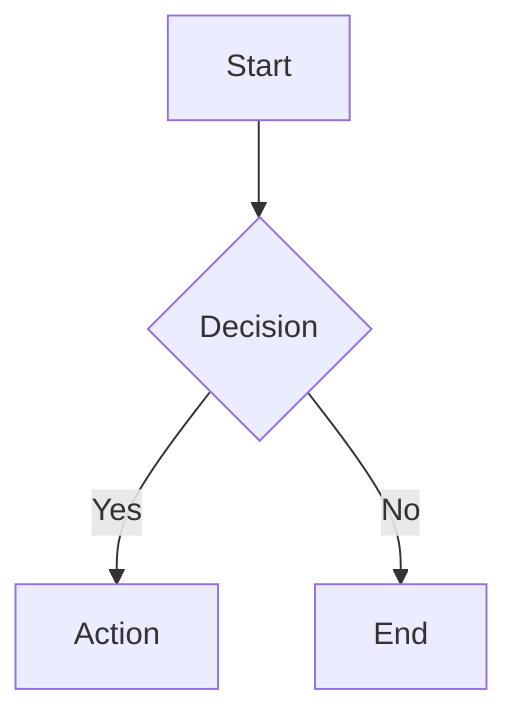

# Protection Fixture

This fixture tests all preservation edge cases.

## Code Fences

Basic code fence:
```
plain code block
```

Code fence with language:
```python
def hello():
    return "world"
```

Code fence with backticks:
```javascript
const x = `template ${literal}`;
```

Code fence with tildes:
~~~ruby
puts "hello"
~~~

## Inline Code

Simple inline: `code`

Multiple backticks: ``code with `backtick` inside``

Inline with special chars: `$var`, `<tag>`, `[bracket]`

## Math Variants

Inline dollar math: $E=mc^2$ and $\alpha + \beta = \gamma$

Display dollar math:

$$
\int_{0}^{\infty} e^{-x^2} dx = \frac{\sqrt{\pi}}{2}
$$

Inline bracket math: \(x^2 + y^2 = z^2\)

Display bracket math:

\[
\sum_{i=1}^{n} i = \frac{n(n+1)}{2}
\]

LaTeX environment:

\begin{equation}
f(x) = \int_{-\infty}^{\infty} \hat{f}(\xi) e^{2\pi i \xi x} d\xi
\end{equation}

## Links and Images

Inline link: [OpenAI](https://openai.com)

Image: 

Link with title: [Example](https://example.com "Title")

Reference link: [Reference][ref]

[ref]: https://example.com/reference

Image reference: ![Image][img-ref]

[img-ref]: https://example.com/img.png

## Tables

| Column 1 | Column 2 | Column 3 |
|----------|----------|----------|
| Cell 1   | Cell 2   | Cell 3   |
| Data A   | Data B   | Data C   |

## HTML Tags

Inline HTML: <span class="highlight">text</span>

Block HTML:
<div class="container">
  <p>Paragraph</p>
</div>

Comment: <!-- This is a comment -->

Self-closing: <br/>

DOCTYPE: <!DOCTYPE html>

## Mermaid Diagram



## Footnotes

Here is a footnote reference[^1].

[^1]: This is the footnote content.

## Edge Cases

Escaped dollar: \$100

Escaped backtick: \`not code\`

Nested structures: `code with text` and $math with symbols$

Multiple inline: `code1` and `code2` and $x$ and $y$

URL in code: `https://example.com`
